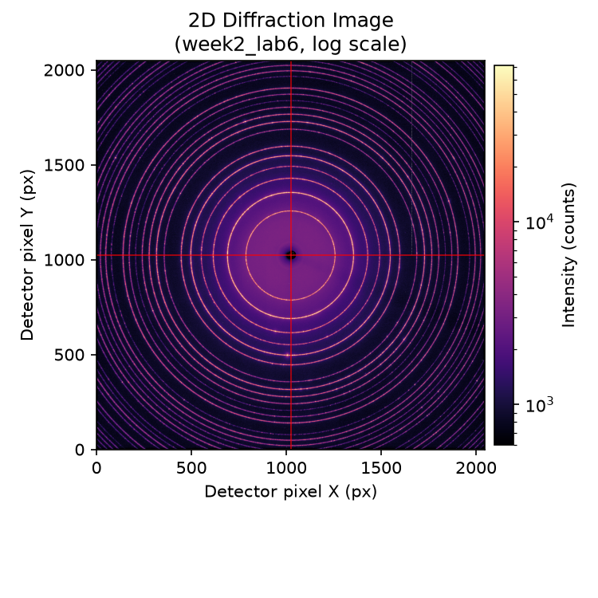
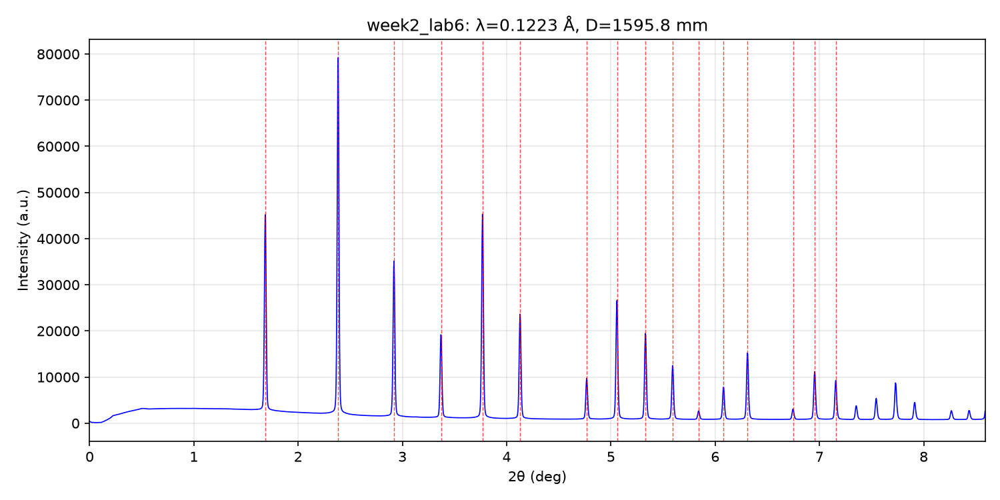
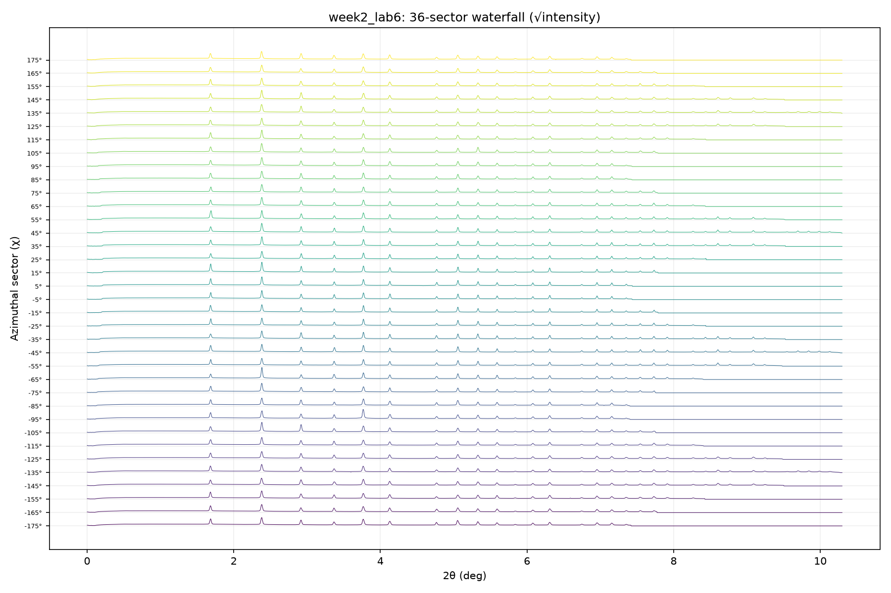

# XRD Toolkit


A modular Python toolkit for X-ray diffraction (XRD) data analysis, developed as part of *PHY6528 Advanced Research in Applied Physics* at City University of Hong Kong. It reads 2D diffraction images (`.tif` / `.edf` / `.cbf`), localizes the ring center automatically, calibrates the detector geometry against a LaB₆ standard (pyFAI), and integrates the 2D pattern into standard 1D powder diffraction spectra — including sector-wise integration for azimuthal uniformity analysis.

中文说明：[README.zh-CN.md](docs/README.zh-CN.md)

## Highlights

- **Automatic ring-center localization** — the direct-beam position is found by FFT cross-correlation, exploiting the fact that a diffraction pattern is centrosymmetric about the ring center. Fully automatic on any new dataset, accuracy < 1 px.
- **Geometric calibration with a LaB₆ standard** — pyFAI `GeometryRefinement` refines detector distance and PONI from known LaB₆ peak positions (NIST SRM 660, a = 4.156 Å). Example result: detector distance refined to 1595.79 mm.
- **2D → 1D integration** — full 0°–360° azimuthal integration into a standard two-column powder pattern (2θ, intensity), ready for peak finding, profile fitting, and PDF analysis.
- **Sector-wise integration** — the pattern is split into N azimuthal sectors (default 36) and integrated separately; waterfall plots reveal preferred orientation or large-grain spotiness.
- **Shared interactive CLI** — one file-selection menu (`xrd_toolkit/cli.py`) reused by all four scripts: number selection, `1,2` multi-select, or `all`.

## Installation

```bash
# 1. Create the conda environment (once)
conda env create -f environment.yml
# 2. Activate it
conda activate XRD_Toolkit_Environment
# 3. Install this package in editable mode (numpy / matplotlib / fabio / pyFAI come along)
pip install -e .
```

## Usage

Typical workflow: `view_diffraction` (inspect) → `calibrate_integrate` (geometry) → `integrate_pattern` (1D pattern) → `sector_waterfall` (uniformity). All outputs are written under `outputs/{dataset_name}/`.

Each script accepts either `--file` to pick one dataset, or — without `--file` — an interactive menu listing all files in `data/`.

| Script | What it does |
|---|---|
| `scripts/view_diffraction.py` | 2D image viewer (log scale, line profile, auto ring-center mark) |
| `scripts/calibrate_integrate.py` | LaB₆ geometric calibration (pyFAI) + azimuthal integration (2D → 1D) |
| `scripts/integrate_pattern.py` | Full-angle integration: 2D image → standard 1D powder pattern (two-column txt) |
| `scripts/sector_waterfall.py` | Sector integration (36 sectors) + waterfall plots + azimuthal uniformity statistics |

### View a diffraction image

```bash
python scripts/view_diffraction.py --file data/xxx.tif --angle 0 --outdir outputs
```

Options: `--center cx,cy` (auto-detected if omitted), `--angle` (profile angle in degrees, default 0), `--outdir` (default `outputs/`).

### Geometric calibration + 1D pattern (LaB₆ standard)

```bash
python scripts/calibrate_integrate.py --file data/xxx.tif --wavelength 0.1223 --pixel 200 --dist0 1600
```

`--wavelength` X-ray wavelength (Å), `--pixel` detector pixel size (µm), `--dist0` initial detector distance (mm, refined by pyFAI). The pipeline fits the LaB₆ peak positions (`GeometryRefinement`), then integrates azimuthally and writes `calibrated_2th.txt` + `calibrated.png` (red dashed lines = theoretical LaB₆ positions). Calibration and integration live in `xrd_toolkit/services/integrator.py`.

### Full-angle integration (2D → 1D standard pattern)

```bash
python scripts/integrate_pattern.py --file data/xxx.tif
```

Integrates 0°–360° with the calibrated geometry (defaults to the reference calibration, e.g. 1595.79 mm) and writes a two-column txt (2θ(deg), intensity) + PNG. Override with `--dist`, `--poni`, `--wavelength`.

### Sector integration + waterfall plots

```bash
python scripts/sector_waterfall.py --file data/xxx.tif --n-sectors 36
```

Splits the 0°–360° azimuth into N sectors (default 36, one per 10°), integrates each sector separately, and writes per-sector two-column txt files under `outputs/{dataset_name}/sectors/` plus two waterfall plots (raw / normalized) for checking ring uniformity — large grains or preferred orientation show up as intensity concentrated in a few sectors.

> Note: sample data are not included in this repository — point `--file` at your own diffraction data.

## Output examples

2D diffraction image (log scale; the black-bordered white-core cross marks the auto-localized ring center; white dashed line = profile sampling direction; title shows the center coordinates):



Intensity profile through the center (x-axis: distance from center in pixels):


Calibrated 1D pattern (red dashed lines: theoretical LaB₆ peak positions):



36-sector waterfall plot (each curve offset along Y by its azimuthal angle):



## Project structure

```
.
├── data/                          # raw XRD images (.tif), not tracked by git
├── outputs/                       # example figures & integrated data (per dataset)
├── scripts/
│   ├── view_diffraction.py        # 2D viewer (image + line profile + auto center)
│   ├── calibrate_integrate.py     # LaB₆ geometric calibration + azimuthal integration
│   ├── integrate_pattern.py       # full 2D → 1D integration
│   └── sector_waterfall.py        # sector integration + waterfall plots
├── src/xrd_toolkit/
│   ├── config.py                  # global configuration (calibrated geometry, single source of truth)
│   ├── cli.py                     # shared interactive file-selection menu (used by all scripts)
│   ├── core/processor.py          # image processing (line profiles, auto ring-center localization)
│   └── services/
│       ├── data_loader.py         # image I/O (fabio)
│       └── integrator.py          # geometry refinement + 1D integration (pyFAI)
├── tests/                         # unit tests (in progress)
├── docs/                          # Chinese README (original)
├── environment.yml                # conda environment (one-command setup)
├── pyproject.toml                 # package metadata & dependencies
└── README.md
```

## Roadmap (Semester B)

- Line-profile analysis: Scherrer / Williamson–Hall size–strain
- Structure-factor simulation
- A basic Rietveld refinement engine
- Machine learning: clustering for phase identification and CNN peak-shape classification

## Author

Chenze Bian — MSc in Physics with Data Modelling and Quantum Technologies, City University of Hong Kong · [GitHub](https://github.com/xyyzzc3)

## License

[MIT](LICENSE)
