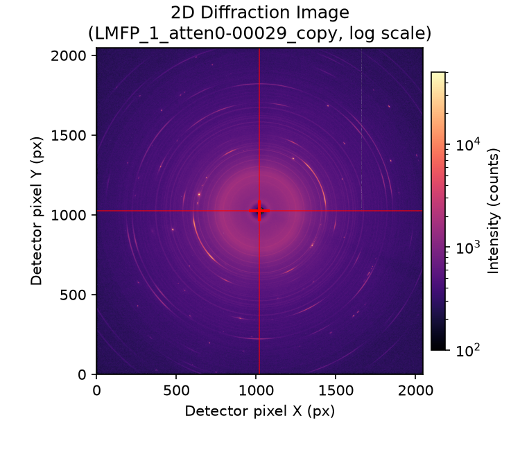
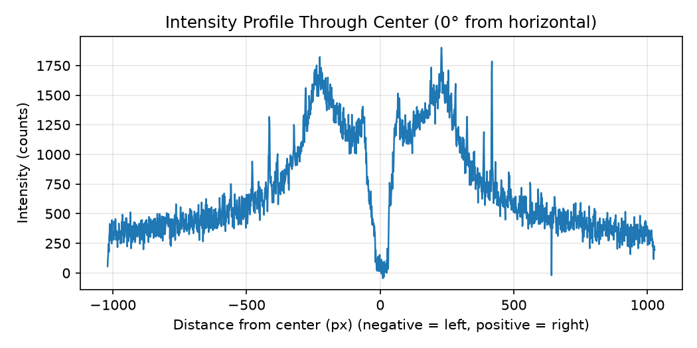

# Weekly report (archived)

## 1. 本周完成情况
- [x] 环境配置（Conda + PyCharm）
- [x] 读取 tif 并显示图像
- [x] 代码微调（至少3项）
- [x] Git 推送

## 2. 遇到的问题与解决方案
| 问题         | 解决方案   |
|:-----------|:-------|
| project格式  | 使用常见模版 |
| for循环问题    | 学习     |
| 作图以及改可视化参数 | 学习     |


## 3. 学习工具记录
- (removed) 
  - (removed).
- (removed)
  - (removed)。

## 4. 项目结构

```
.
├── data/                       # XRD 原始数据（.tif，不进 git）
├── outputs/                    # 生成的示例图（PNG）
├── scripts/
│   └── view_diffraction.py     # 衍射图查看器（画图 + 线剖面）
├── src/xrd_toolkit/
│   ├── main.py                 # 程序入口
│   ├── config.py               # 全局配置
│   ├── core/processor.py       # 图像计算（线剖面等）
│   ├── services/data_loader.py # 数据读取（fabio）
│   └── utils/                  # 工具函数
├── tests/                      # 测试
├── pyproject.toml              # 项目元信息与依赖
└── README.md                   # 本文件
```

## 5. 输出示例

二维衍射图（对数色标，红色十字为环圆心）：



过圆心的强度剖面（横轴为到圆心的距离，单位像素）：


