# XRD Toolkit


A modular Python toolkit for X-ray diffraction (XRD) data analysis, developed as part of *PHY6528 Advanced Research in Applied Physics* at City University of Hong Kong. It reads 2D diffraction images (`.tif` / `.edf` / `.cbf`), calibrates the detector geometry against a LaB₆ standard (pyFAI, with automatic ring-center localization as the starting point), and integrates the 2D pattern into standard 1D powder spectra — including sector-wise azimuthal uniformity analysis. All scripts except calibration read a named geometry config from `src/xrd_toolkit/config.py` (selectable via `--config`, default `lmfp1_lab6`).

中文说明：[README.zh-CN.md](docs/README.zh-CN.md)

## At a glance

<details open>
<summary>Show / hide figures</summary>

<table>
  <tr>
    <td align="center" width="50%">
      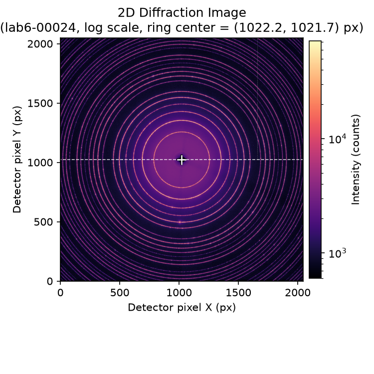<br>
      <sub>2D diffraction image (log scale) — cross marks the calibrated beam center</sub>
    </td>
    <td align="center" width="50%">
      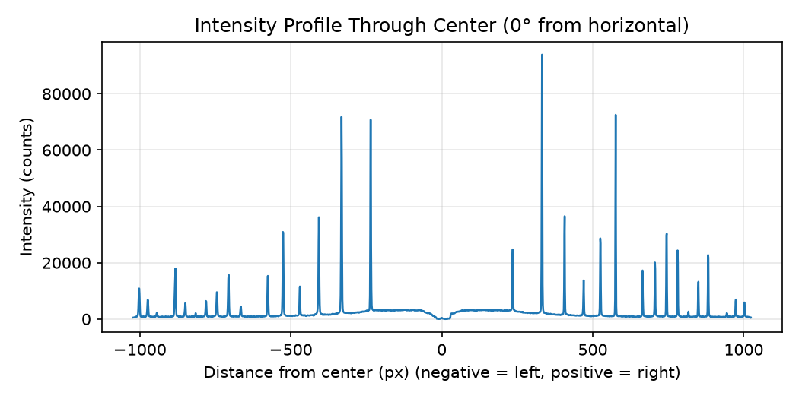<br>
      <sub>Radial intensity profile through the center</sub>
    </td>
  </tr>
  <tr>
    <td align="center" width="50%">
      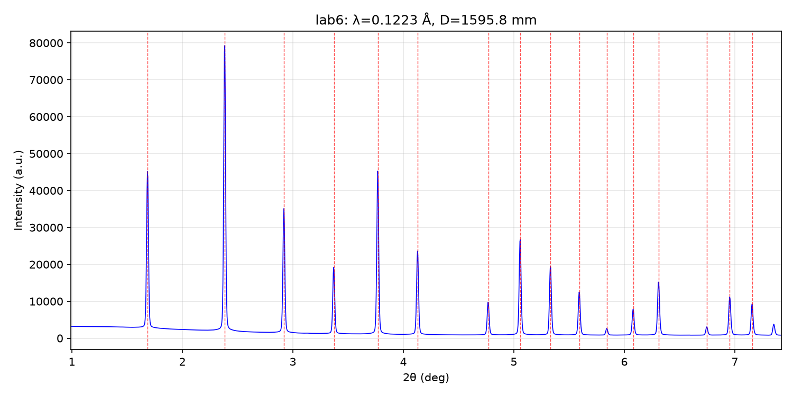<br>
      <sub>Calibrated 1D powder pattern (red dashed = theoretical LaB₆ positions)</sub>
    </td>
    <td align="center" width="50%">
      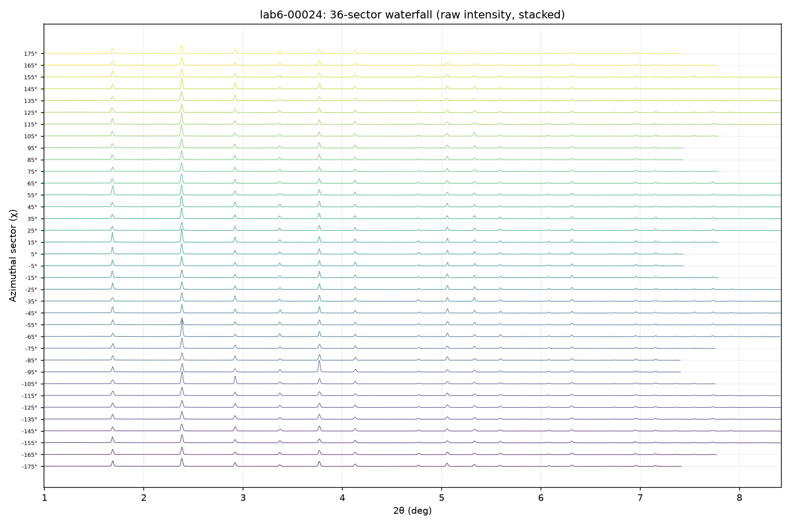<br>
      <sub>36-sector waterfall plot — azimuthal uniformity check; the staircase right edge marks where each sector's ring is clipped by the detector</sub>
    </td>
  </tr>
</table>

Figures generated from a LaB₆ standard calibration dataset (NIST SRM 660).

</details>

## GUI

A PySide6 desktop front end on top of the same analysis engine — inspect raw images, integrate, overlay and polish plots without touching a terminal:

```bash
python -m xrd_toolkit.gui
```

<table>
  <tr>
    <td align="center" width="50%">
      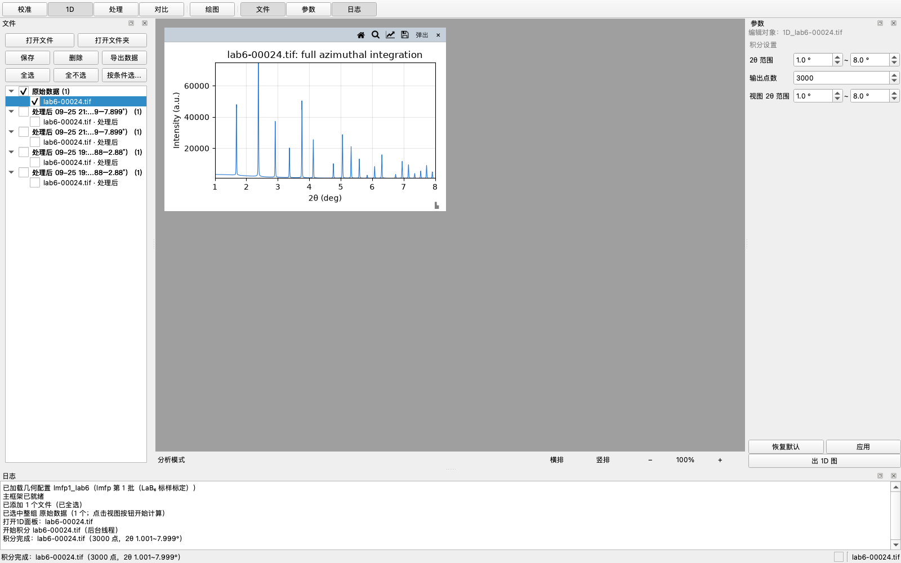<br>
      <sub>Main window — LaB₆ standard integrated to 1D, parameter dock on the right</sub>
    </td>
    <td align="center" width="50%">
      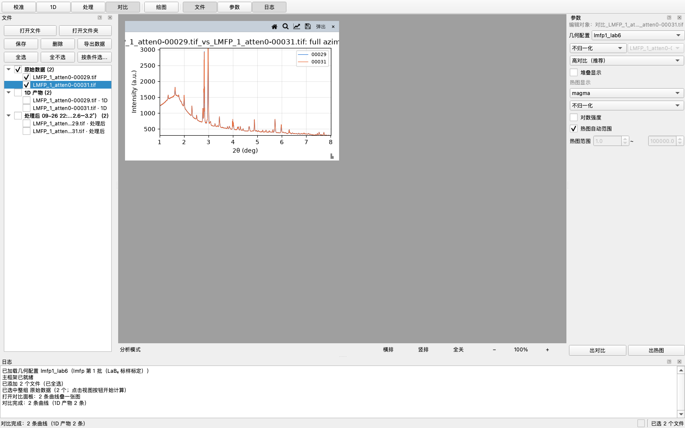<br>
      <sub>Compare view — two LMFP scans overlaid with legend</sub>
    </td>
  </tr>
  <tr>
    <td align="center" colspan="2">
      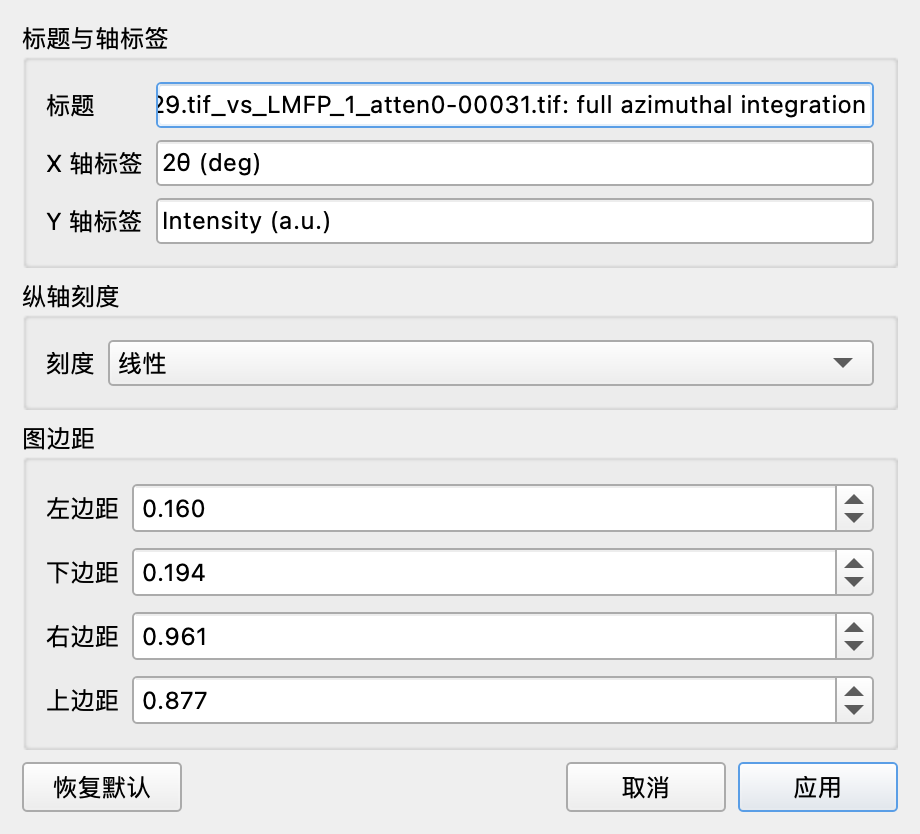<br>
      <sub>Customize dialog — title, axis labels, linear–log y scale, figure margins, per-curve colors (Compare panels)</sub>
    </td>
  </tr>
  <tr>
    <td align="center" colspan="2">
      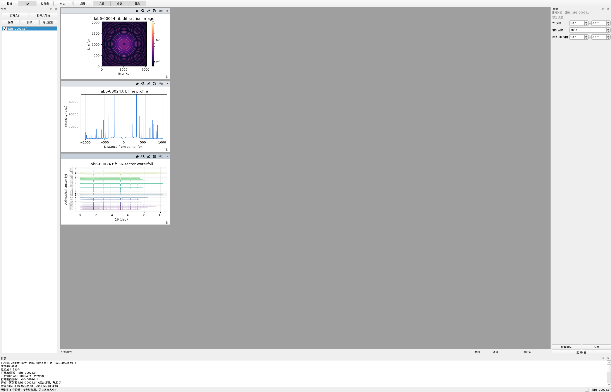<br>
      <sub>2D / Profile / Waterfall views — every one-click view now renders real data (LaB₆ standard)</sub>
    </td>
  </tr>
  <tr>
    <td align="center" colspan="2">
      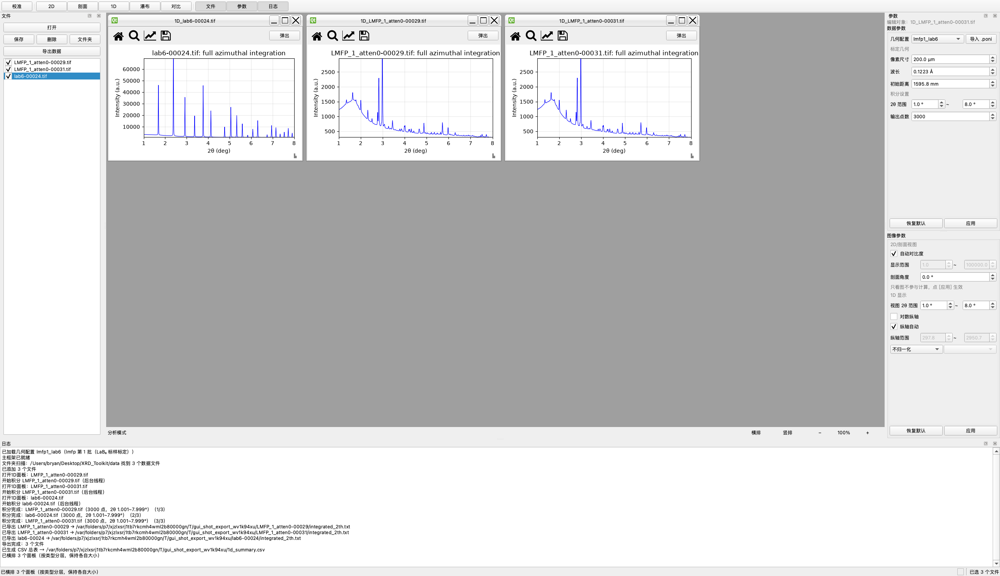<br>
      <sub>Batch pipeline — a folder imported at once, three real datasets integrated with live progress（k/n）in the log, then exported to txt + CSV summary</sub>
    </td>
  </tr>
  <tr>
    <td align="center" colspan="2">
      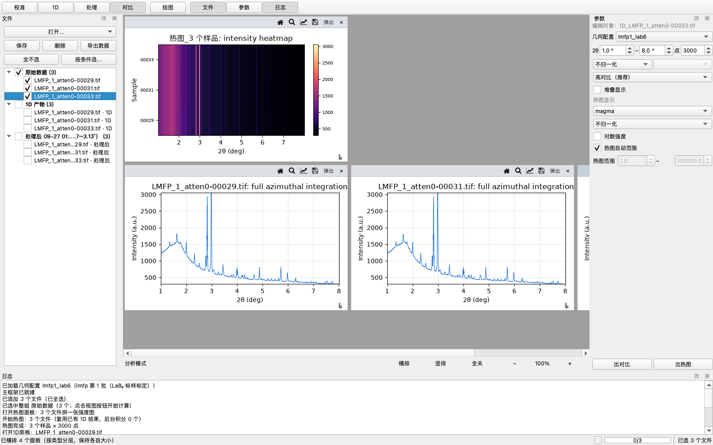<br>
      <sub>Batch heatmap — three real datasets' 1D curves assembled into a 2θ × sample intensity map (per-row normalization), with a single 1D pattern alongside</sub>
    </td>
  </tr>
  <tr>
    <td align="center" colspan="2">
      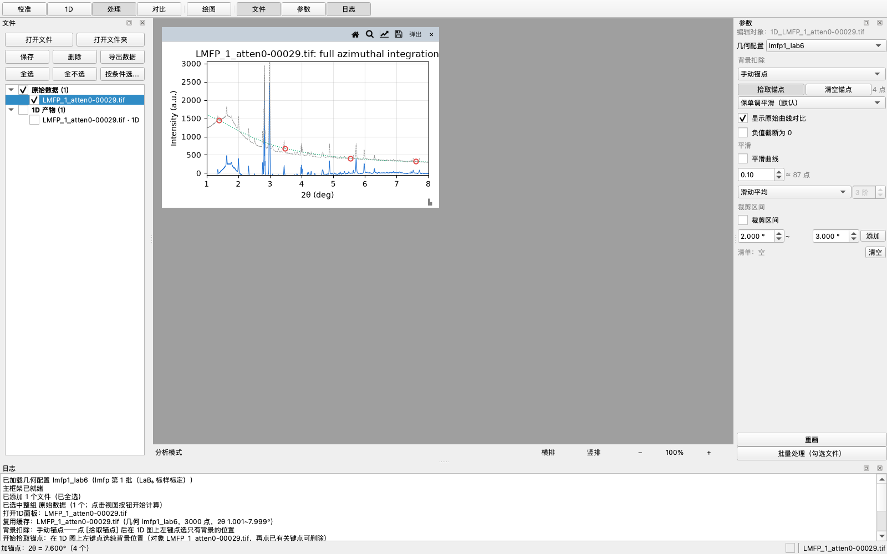<br>
      <sub>Background subtraction — manual anchors on a real LMFP pattern: the raw curve (dashed), the baseline through four clicked anchors (dotted) and the subtracted result (solid), previewed live as you tune</sub>
    </td>
  </tr>
  <tr>
    <td align="center" colspan="2">
      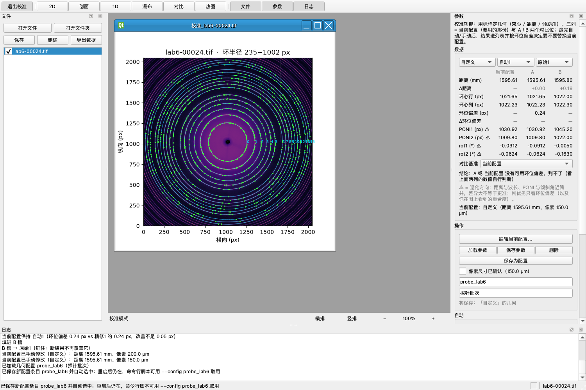<br>
      <sub>Calibration page on the LaB₆ standard — the current config beside comparison slots A and B, each column carrying distance / ring centre / ring-position deviation, with base-relative Δ rows and a verdict line. The borrowed start (0.259 px) is replaced by the first calibration result (0.236 px) — the rule for a new batch; the second run lands at 0.239 px, slightly worse, so it stays a comparison column instead of replacing anything</sub>
    </td>
  </tr>
</table>

- **Independent plot panels** — every plot is an MDI subwindow with free resizing (each drag remembers the panel's own aspect), pop-out into a separate OS window, cascade / tile arrangements, and a zoomable drawing area (Ctrl + wheel, Excel-style).
- **One-click views** — [2D] [Profile] [1D] [Waterfall] buttons plot all checked files at once; [Compare] overlays several 1D curves in one panel with four normalization modes (per-curve strongest peak / strongest of all / a chosen file / off), drawn in a colorblind-safe high-contrast palette (switchable to the matplotlib cycle in the parameter dock; per-curve colors via Customize), or waterfall-stacked — each row offset by 0.7 × the previous row's peak, y ticks labeled by file name. All views are fully wired: 2D shows the raw image (log-intensity magma colormap with colorbar, auto or manual contrast, beam-center cross), Profile samples a line through the beam center at a chosen angle, 1D is the full azimuthal integration, and Waterfall stacks 36 sector-wise integrations (rows labeled by sector χ, each curve cut where the detector clips it).
- **Batch heatmap** — [热图] assembles the checked files' 1D curves into one 2θ × sample intensity heatmap (x = 2θ, y = sample index labeled by file name, color = intensity, with colorbar) for in-situ experiments: peak position, intensity and shape changes across samples (time / state of charge) at a glance. Already-integrated curves are reused and missing ones integrate in the background with the live progress counter; mismatched 2θ grids are re-interpolated onto the first file's grid (noted in the log). Adjustable colormap (magma / viridis / plasma / inferno / gray), intensity normalization (per-row strongest peak / strongest of all / off), log intensity, and display range (auto 1%–99.9% percentile or manual). Clicking a heatmap row toggles that sample's curve in any open Compare panel (a drag still pans).
- **Live parameter dock** — data and display parameters per panel (tooltips everywhere, Reset / Apply per group, per-panel snapshots); the 2θ range of the data group bounds the integration itself (npt samples within it), while zoom / pan writes the view range back in real time.
- **Panel gestures** — left-drag pans; with the magnifier lit, the wheel zooms around the cursor (10% per notch) and left-drag draws a **box zoom** (the rubber band is drawn by us and only ever changes the axis ranges, never the data); hover shows a data-point readout in the status bar; every panel edge has a resize grip.
- **One-row panel chrome** — a single row per panel carries the buttons (Home — back to the panel's own view; zooming and panning do not move it, a recompute does / magnifier / Customize (title, axis labels, linear–log y scale, figure margins; Compare panels add one color per curve) / Save image (PNG or TIF at a chosen DPI), plus pop-out and close. Drag that row to move the panel, double-click to fill the plot area — the native title bar was replaced by this self-drawn row, which takes the shell from 83 px down to 26 px (57 px more plot in the same panel height). Popped-out panels get the system title bar back for window management, with the row still carrying the buttons. The row shows no name of its own — the dataset already appears in the parameter dock's edit target and in the plot title, and hovering the row shows it — while the panel that is the current edit target gets a darker shade of that row, the usual active/inactive convention.
- **Calibration mode** — a [校准] toggle opens the calibration page: a three-column table — **current config** plus two comparison slots **A** and **B**, each selectable from everything produced so far — over two action blocks, 自动 (locate the ring centre and refine / refine again from the current geometry) and 手动 (pick rings by hand: ≥ 3 points, ≥ 2 rings, ±0.5° snapping). The current config starts as the raw geometry borrowed from the selected entry; [编辑…] types values in or prefills from another entry, and any hand edit marks it 自定义 so nothing replaces it automatically. **Every result accumulates under its own name** (原始 / 自动1 / 手动1 / 精修1 …) and lands in a slot by rotation A → B → A — unless you picked that slot by hand, in which case it is pinned and new results stop overwriting it. **Which geometry is in use is decided by the engine metric**: a result replaces the current config only when it wins by more than 0.05 px of ring-position deviation (repeating the same image moves the fitted geometry by PONI 1.6–2.2 px but the ring deviation by only 0.014–0.029 px, so anything smaller is run-to-run noise). Any two columns can be compared: choose a base (current config / A / B) and read the Δ rows — distance and ring-position deviation — plus a verdict line. PONI and tilt carry a ⚠ because they are degenerate with distance and wavelength, and the self-consistency residual is deliberately kept out of the table — it measures convergence, not accuracy. The way back is never hidden: the toggle reads [退出校准] while the workbench is open, and the page itself ends in a [返回分析模式] button that flips it back. [Save as config] stores the refined geometry as a named entry (a local user file outside git) that instantly joins the geometry dropdown — selected automatically — survives restarts, and is usable from the CLI via `--config`. The overlaid cyan rings are the *exact* rings the current geometry predicts: every point is reverse-solved from pyFAI's own 2θ map, so a tilted detector appears as the ellipse it really is — a plain "center + radius" circle would sit 8–23 px off, because the common center of the rings is the direct-beam spot, not the PONI. Point picking judges against that same geometry, so clicking a drawn ring cannot land on the neighbouring ring index, and if the geometry puts all 16 rings off the detector (distance / pixel-size / wavelength mismatch, or a wild refinement) the panel says so in the log and zooms out until they are visible instead of silently drawing nothing. Every run also reports **engine metrics** in the log: the median ring-position deviation in px (with the pre-refinement initial value beside it), how many of the 16 rings came out complete, and the dispersion of the LaB₆ lattice constant back-solved ring by ring. These measure what the fit residual cannot — a run can report a 0.0000° residual while the rings sit ~10 px off the real ones (measured on a deliberately mis-picked point set), because the residual is a self-consistency number, not an accuracy metric. Ring-position deviation catches uniform geometry error; the lattice-constant dispersion catches per-ring mismatch (wrong ring index, distortion, a peak pushed aside). Distance and wavelength are first-order degenerate on a standard, so a distance error barely moves the dispersion — do not use it to detect one. New batches start from the current config: borrow another entry or type values in [编辑…], or import a .poni with [加载参数]. Calibration is blocked until the pixel size is confirmed — and the confirmation comes back only when the pixel value actually changes. The metrics cannot catch a wrong pixel size: distance, wavelength and pixel size enter only as a product, so the rings still land perfectly while the reported distance (and everything derived from it) is off by that factor. [保存为配置] stores the current config — borrowed, typed or adopted — together with its provenance (`derived_from`, `method`, `created`). The analysis page is read-only where geometry is concerned: it selects an entry and shows the geometry as a greyed summary, and the [加载参数] / [保存参数] / [删除] buttons now live on the calibration page instead.
- **Batch pipeline** — [打开文件夹] imports a whole folder (every .tif/.tiff/.edf/.cbf inside, duplicates skipped automatically — or just drag a folder onto the window) and any view button processes all checked files at once, with a live progress counter in the log (completion lines end in （k/n）). [导出数据] saves each file's 1D result as a two-column `integrated_2th.txt` or `.chi` under `outputs/{file}/` — byte-identical format to the CLI — with an optional `1d_summary.csv` (one intensity column per file; when 2θ grids differ, a dialog offers the common intersection with re-interpolation, skipping the mismatched files, or cancelling). A single failed file never aborts the batch.
- **Save / load .poni geometry** — the [保存参数] button beside the geometry dropdown writes the currently selected config as a standard pyFAI .poni exchange file (detector distance, center as poni1/poni2 in meters, pixel size, wavelength, tilt rot1/rot2; the optional mask path is not written — the engine has no mask support yet and the .poni format has no mask field), and [加载参数] reads a .poni into a named config entry: stored like [Save as config], auto-selected immediately, surviving restarts — calibrate once, reuse everywhere, no re-calibration needed. Imported or saved user entries can be removed again with the [删除] button (greyed out for builtin registry entries): a confirmation dialog guards the removal, and the selection then falls back to the default entry.

- **Background subtraction** — the parameter dock's 背景扣除 section removes what carries no structural information: air scatter, amorphous diffuse scattering, fluorescence, detector dark current, beam-stop halo. It matters here: both samples' background rises 3.8–5.2× toward low 2θ (LMFP 1429 counts at 1–2° vs 275 at 9–10°), so a constant offset cannot work. Three modes, every one previewed live (parameters change the drawing only — the cached raw curve is never touched, so nothing re-integrates): **empty-scan subtraction** (subtract a blank measurement, with a normalization factor for differing exposure/beam current), **auto baseline** (rolling-window level estimate; set the window to 3–10× the widest peak's width), and **manual anchors** (click points that are background only — the baseline joins them, extrapolated linearly past the first/last anchor). While subtracting, the 1D panel overlays the raw curve (dashed) and the baseline (dotted) on the subtracted one, so before/after is visible as you tune. Anchors are stored per file; Compare / Waterfall / Heatmap apply the same settings (the waterfall subtracts one common sector-mean baseline so sector-to-sector intensity differences survive), and [导出数据] can write the subtracted curves. Negative values after subtraction are kept by default — the noise floor is real, and clipping it at 0 biases the mean up by ~1σ — with an opt-in checkbox to clip. SNIP was implemented and measured as well, but it over-subtracts by 43–98% on these patterns (it clips the broad amorphous hump at ~2.2° as if it were a peak), so the GUI does not offer it.

## Highlights

- **Automatic ring-center localization (calibration starting point)** — the direct-beam position is found by FFT cross-correlation, exploiting the fact that a diffraction pattern is centrosymmetric about the ring center; accuracy < 1 px. It is used only as the initial value for geometric calibration — every other step uses the geometry of the config selected via `--config` from `src/xrd_toolkit/config.py`.
- **Geometric calibration with a LaB₆ standard** — pyFAI `GeometryRefinement` refines detector distance and PONI from known LaB₆ peak positions (NIST SRM 660, a = 4.156 Å). Example result: detector distance refined to 1595.80 mm (stored as config `lmfp1_lab6` in `src/xrd_toolkit/config.py`).
- **2D → 1D integration** — full 0°–360° azimuthal integration into a standard two-column powder pattern (2θ, intensity), ready for peak finding, profile fitting, and PDF analysis.
- **Automatic 2θ range selection** — `--range auto` (default) picks the interval with one standard per material: lower bound from the material's standard (first known peak − 0.3° for powder samples; detected halo end − 0.6° ≈ 1.0° for the LaB₆ standard), upper bound auto-detected where the data starts failing. The failure criterion is relative arc coverage — the ring's fraction of azimuth inside the detector falling below 50% of its own maximum — so one criterion adapts to any beam placement: ≈ 7.9° for a centered beam (the old 80% absolute criterion stopped at ≈ 7.44°), and automatically later for off-center beams. Single-curve scripts use the exact geometric value; the waterfall's sector-based measured value lands ≈ 0.5° later (10° sector quantization) — the two are cross-checked and a warning fires only on a real mismatch. The full-range txt master copy is always saved.
- **Off-center (partial-ring) beam support** — datasets recorded with the beam deliberately placed at the detector edge or corner (each ring only partially captured, revealing higher-2θ rings) are handled end to end: a built-in numpy polar integration takes over automatically when pyFAI's radial binning becomes unreliable (pyFAI bins relative to the detector center, verified on synthetic rings), sector χ labels report the actually covered azimuth span instead of a fake 360°, and the waterfall statistics average only over sectors with real signal. Calibration on such datasets should be done on a centered standard image (distance/tilt are instrument properties); `--center` documents this.
- **Named geometry configs** — per-batch calibrated geometries are registered in `src/xrd_toolkit/config.py` and selected with `--config` (in interactive mode, a second menu picks the config after the data files). Calibration prints a copy-paste-ready entry to register a new batch.
- **Sector-wise integration** — the pattern is split into N azimuthal sectors (default 36) and integrated separately; the stacked raw-intensity waterfall (one curve per sector, each drawn until its own intensity drops to zero) reveals preferred orientation or large-grain spotiness and visualizes the detector-clipping geometry.
- **Shared interactive CLI** — one file-selection menu (`xrd_toolkit/cli.py`) reused by all four scripts: number selection, `1,2` multi-select, or `all`.

## Quick start

```bash
# 1. Create the conda environment (once)
conda env create -f environment.yml
# 2. Activate it
conda activate XRD_Toolkit_Environment
# 3. Install this package in editable mode (numpy / scipy / matplotlib / fabio / pyFAI come along)
pip install -e .
```

> Note: sample data are not included in this repository — point `--file` at your own diffraction data.

> Environment self-check: `python scripts/check_env.py` answers "can this repo run right now?" in one command (interpreter, dependencies, editable-install target, GUI import, tests & data). **After moving or renaming the project folder**, re-run `pip install -e .` — the editable install stores an absolute path, so a move breaks `import xrd_toolkit` even though no source file changed.

> GUI link check: `python scripts/check_gui.py` walks the interface with real sample data (real integration + real mouse events: hover, anchor picking, wheel zoom, compare, heatmap). An all-green unit suite can still hide a dead click path — this one verifies at the canvas-callback layer, so it is worth a run after moving code between GUI modules.

## Scripts

Typical workflow: `view_diffraction` (inspect) → `calibrate_integrate` (geometry) → `integrate_pattern` (1D pattern) → `sector_waterfall` (uniformity). All outputs are written under `outputs/{dataset_name}/`.

Each script accepts either `--file` to pick one dataset, or — without `--file` — an interactive menu listing all files in `data/`. The three consuming scripts also accept `--config NAME` to select a geometry config (default `lmfp1_lab6`); in interactive mode, after picking the data files a second menu asks for the config. `calibrate_integrate.py` prints a copy-paste-ready entry to register a newly calibrated batch in `src/xrd_toolkit/config.py`.

| Script | What it does |
|---|---|
| `scripts/view_diffraction.py` | 2D image viewer (log scale, line profile, calibrated beam-center mark) |
| `scripts/calibrate_integrate.py` | LaB₆ geometric calibration (pyFAI) + azimuthal integration (2D → 1D) |
| `scripts/integrate_pattern.py` | Full-angle integration: 2D image → standard 1D powder pattern (two-column txt) |
| `scripts/sector_waterfall.py` | Sector integration (36 sectors) + waterfall plots + azimuthal uniformity statistics |
| `scripts/check_env.py` | Environment self-check — interpreter, dependencies, editable-install target, GUI import, tests & data (not an analysis script; run it first when something "just won't run") |
| `scripts/check_gui.py` | GUI link check — drives the real window offscreen with real sample data and real canvas events (hover, anchor picking, wheel zoom, compare, heatmap) to prove the UI wiring still reaches the engine (not an analysis script; run it after moving code between GUI modules) |

## Usage details

<details>
<summary><b>View a diffraction image</b> — <code>scripts/view_diffraction.py</code></summary>

```bash
python scripts/view_diffraction.py --file data/xxx.tif --angle 0 --outdir outputs
```

- `--file`: diffraction image path (.tif / .edf / .cbf)
- `--center`: ring center `cx,cy` — defaults to the beam center of the selected config
- `--config`: geometry config name from `config.py` (default `lmfp1_lab6`)
- `--angle`: profile angle in degrees (default 0)
- `--outdir`: PNG output directory (default `outputs/`)

</details>

<details>
<summary><b>Geometric calibration + 1D pattern (LaB₆ standard)</b> — <code>scripts/calibrate_integrate.py</code></summary>

```bash
python scripts/calibrate_integrate.py --file data/xxx.tif --wavelength 0.1223 --pixel 200 --dist0 1600
```

- `--wavelength`: X-ray wavelength (Å)
- `--pixel`: detector pixel size (µm)
- `--dist0`: initial detector distance (mm) — refined automatically by pyFAI
- `--center`: initial ring center `cx,cy` in pixels (default: auto-localized, < 1 px accuracy). Pass it explicitly for off-center-beam (partial-ring) datasets: the auto-localizer needs full rings, and refinement is unreliable there — calibrate distance/tilt on a centered standard image instead
- `--max-rings`: number of LaB₆ rings used for calibration (default 16)
- `--range`: 2θ range — `full`, `auto` (default, per-material standard), or `lo,hi` degrees (e.g. 1.3,7.3); the full txt is always saved
- `--outdir`: output directory (default `outputs/`)

Pipeline: LaB₆ peak-position calibration (pyFAI `GeometryRefinement`) → azimuthal integration (2D → 1D) → writes `calibrated_2th.txt` + `calibrated.png` (red dashed lines = theoretical peak positions). Code in `xrd_toolkit/services/integrator.py`. After refinement, a copy-paste-ready `CONFIGS` entry is printed so the new batch can be registered in `src/xrd_toolkit/config.py` (the script never writes that file itself).

</details>

<details>
<summary><b>Full-angle integration (2D → 1D standard pattern)</b> — <code>scripts/integrate_pattern.py</code></summary>

```bash
python scripts/integrate_pattern.py --file data/xxx.tif
```

Integrates 0°–360° with the geometry of the selected config (default `lmfp1_lab6`, e.g. 1595.80 mm) and writes a two-column txt (2θ(deg), intensity) + PNG. Override with `--dist`, `--poni`, `--wavelength`; `--range full/auto/lo,hi` controls the 2θ interval of the plot and the `_auto` trimmed txt (full txt always saved).

</details>

<details>
<summary><b>Sector integration + waterfall plots</b> — <code>scripts/sector_waterfall.py</code></summary>

```bash
python scripts/sector_waterfall.py --file data/xxx.tif --n-sectors 36
```

Splits the 0°–360° azimuth into N sectors (default 36, one per 10°), integrates each sector separately (geometry from the selected `--config`, default `lmfp1_lab6`), and writes per-sector two-column txt files under `outputs/{dataset_name}/sectors/` plus a raw-intensity stacked waterfall plot (36 curves offset along the Y axis with adaptive row spacing; each curve is drawn until its own intensity drops to zero, so the staircase right edge marks where each sector's ring is clipped by the detector). Large grains or preferred orientation show up as intensity concentrated in a few sectors. Supports `--range full/auto/lo,hi`.

</details>

## Tests

Synthetic-image unit tests (no sample data needed; plain `unittest`, no pytest):

```bash
conda activate XRD_Toolkit_Environment
python -m unittest discover -s tests -v
```

They cover the arc-coverage failure criterion for centered / edge / corner / outside-image beam placements, the geometric failure-point values, and the off-center integration fallback (regression guard for a pyFAI binning bug). The background-subtraction tests characterise each baseline estimator against synthetic curves with known backgrounds (SNIP preserves a constant background exactly but underestimates a linear ramp; the rolling-window estimate must be told a window 3–10× the peak width), and the GUI tests pin down live preview, per-file anchors and the raw/baseline overlay lines.

## Roadmap

- Peak finding & profile fitting on the 1D patterns (background subtraction landed first — net peak heights and areas are only meaningful once the pedestal is gone)
- Line-profile analysis: Scherrer / Williamson–Hall size–strain
- Structure-factor simulation
- A basic Rietveld refinement engine
- Machine learning: clustering for phase identification and CNN peak-shape classification

## Project structure

```
.
├── data/                          # raw XRD images (.tif), not tracked by git
├── outputs/                       # script outputs, one folder per dataset (local only, not tracked)
├── showcase/                      # curated example figures shown in the README (tracked)
├── scripts/
│   ├── view_diffraction.py        # 2D viewer (image + line profile + auto center)
│   ├── calibrate_integrate.py     # LaB₆ geometric calibration + azimuthal integration
│   ├── integrate_pattern.py       # full 2D → 1D integration
│   └── sector_waterfall.py        # sector integration + waterfall plots
├── src/xrd_toolkit/
│   ├── config.py                  # registry of named geometry configs (one per batch; --config selects)
│   ├── cli.py                     # shared interactive file-selection menu (used by all scripts)
│   ├── core/processor.py          # image processing (line profiles, auto ring-center localization)
│   ├── services/
│       ├── data_loader.py         # image I/O (fabio)
│       ├── integrator.py          # geometry refinement + 1D integration (pyFAI)
│       ├── background.py          # background subtraction: empty scan / auto baseline / anchors (no Qt)
│       ├── range_selector.py      # automatic 2θ range selection (per-material standards)
│       └── ring_metrics.py        # calibration quality: ring coverage, position deviation, lattice-constant consistency
│   └── gui/                       # PySide6 desktop GUI (python -m xrd_toolkit.gui)
├── tests/                         # synthetic-image unit tests (unittest): partial-ring geometry, DIY integration, background estimators, ring metrics
├── docs/                          # Chinese README (original)
├── environment.yml                # conda environment (one-command setup)
├── pyproject.toml                 # package metadata & dependencies
└── README.md
```

## Author

Chenze Bian — MSc in Physics with Data Modelling and Quantum Technologies, City University of Hong Kong · [GitHub](https://github.com/xyyzzc3)

## License

[MIT](LICENSE)
