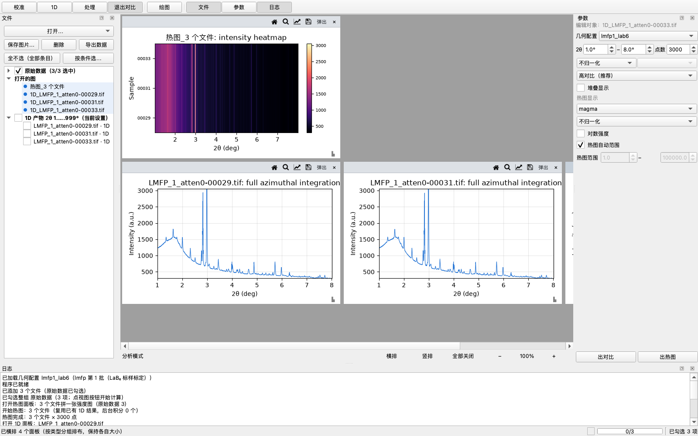

# XRD Toolkit


A modular Python toolkit for X-ray diffraction (XRD) data analysis, developed as part of *PHY6528 Advanced Research in Applied Physics* at City University of Hong Kong. It reads 2D diffraction images (`.tif` / `.edf` / `.cbf`), calibrates the detector geometry against a LaB₆ standard, and integrates the 2D pattern into standard 1D powder spectra — as four CLI scripts and as a PySide6 desktop app over the same engine.

中文说明：[README.zh-CN.md](docs/README.zh-CN.md) · Quick start for trial users: [docs/使用说明.html](docs/使用说明.html) (in-app: Help → 使用说明, F1) · Long version: [docs/NOTES.md](docs/NOTES.md) · Changes: [CHANGELOG.md](CHANGELOG.md) · Citation: [CITATION.cff](CITATION.cff)

## Download & run (no Python needed)

**v0.1.0 trial builds** — self-contained apps built from this repo by GitHub Actions:

| Your machine | Download |
|---|---|
| Windows 10/11 | [XRD-Toolkit-windows.zip](https://github.com/xyyzzc3/xrd_toolkit/releases/latest/download/XRD-Toolkit-windows.zip) |
| Mac, Apple Silicon (M1…M4) | [XRD-Toolkit-macos-apple-silicon.zip](https://github.com/xyyzzc3/xrd_toolkit/releases/latest/download/XRD-Toolkit-macos-apple-silicon.zip) |
| Mac, Intel | [XRD-Toolkit-macos-intel.zip](https://github.com/xyyzzc3/xrd_toolkit/releases/latest/download/XRD-Toolkit-macos-intel.zip) |

Unzip → double-click. The builds are unsigned, so the system blocks the first
launch once: Windows *More info → Run anyway*; macOS *right-click → Open*.
Step-by-step instructions (in Chinese, for lab use): [docs/RELEASE_NOTES.md](docs/RELEASE_NOTES.md) — the zip also carries a Chinese quick-start (`使用说明.html`, also under Help → 使用说明, F1) and third-party license notices (`THIRD_PARTY_NOTICES.txt`, also under Help → 关于).
Requires macOS 13+ / Windows 10+; ~110 MB download.

## Three steps

1. **Open** — `[打开…]` → pick your `.tif` / `.edf` / `.cbf` images (a whole folder works too)
2. **Plot** — check the files → `[1D]` → `[出图（勾选文件）]`
3. **Export** — `[导出数据]` → two-column txt / `.chi` / a combined CSV

Geometry comes from a built-in config for the first LMFP batch; calibrate your
own on the `[校准]` page against a LaB₆ standard, or import a pyFAI `.poni`.

## At a glance

<table>
  <tr>
    <td align="center" width="50%">
      <br>
      <sub>Raw 2D image (log scale) — the cross marks the calibrated beam centre</sub>
    </td>
    <td align="center" width="50%">
      <br>
      <sub>Calibrated 1D powder pattern — red dashed lines are the theoretical LaB₆ positions</sub>
    </td>
  </tr>
  <tr>
    <td align="center" width="50%">
      <br>
      <sub>36-sector waterfall — azimuthal uniformity; the staircase edge marks where the detector clips each ring</sub>
    </td>
    <td align="center" width="50%">
      <br>
      <sub>The GUI on the same data — file tree with stage folders on the left, parameter panel on the right</sub>
    </td>
  </tr>
  <tr>
    <td align="center" width="50%">
      <br>
      <sub>Calibration workbench — current geometry beside comparison slots A / B, engine metrics and a verdict line</sub>
    </td>
    <td align="center" width="50%">
      <br>
      <sub>Batch heatmap — three datasets as one 2θ × sample intensity map</sub>
    </td>
  </tr>
</table>

## Highlights

- **Calibrated 2D → 1D integration** — LaB₆ geometric refinement (NIST SRM 660, a = 4.156 Å) followed by full 0°–360° azimuthal integration into a standard two-column powder pattern `(2θ(deg), intensity)`, ready for peak finding, profile fitting and PDF analysis.
- **Calibration metrics that catch what the fit residual cannot** — every run reports the median ring-position deviation, how many of the 16 rings came out complete, and the per-ring lattice-constant dispersion: a run can print a 0.0000° residual while its rings sit 10 px off the real ones.
- **Background subtraction, live** — empty-scan subtraction (with an exposure/beam-current factor), a rolling-window auto baseline, and manual anchors that set the level while the auto baseline supplies the shape; smoothing (boxcar / Savitzky–Golay) and interval cuts on top. Negatives are kept by default — clipping the noise floor at 0 biases the mean up by ≈ 1σ.
- **Batch workflow with staged products** — integrate a folder; curves and background-subtracted curves are cached per stage (keyed by file fingerprint + geometry + settings, reusable across sessions) and listed as **groups in the file bar**, so an 80-file batch goes to a comparison plot or heatmap in two clicks instead of re-integrating.
- **Off-centre beams and sector analysis** — partial-ring datasets (beam at the detector edge or corner) run end to end, including a built-in numpy integration where pyFAI's radial binning gets unreliable; the 36-sector waterfall exposes preferred orientation and detector clipping.
- **Desktop app over the same engine** — five stage entrances, a live parameter panel, hover readout, box zoom, per-curve styling, `.poni` in/out, PNG/TIF export.

## Install (from source)

```bash
conda env create -f environment.yml    # once
conda activate XRD_Toolkit_Environment
pip install -e .                       # numpy / scipy / matplotlib / fabio / pyFAI / PySide6 come along
python -m xrd_toolkit.gui              # the desktop app
```

> Sample data are not in the repository — point `--file` at your own diffraction images.

```bash
# calibrate + integrate one image (prints a config entry to paste into config.py)
python scripts/calibrate_integrate.py --file data/xxx.tif --wavelength 0.1223 --pixel 200 --dist0 1600
# integrate with an existing geometry, or run the sector/waterfall analysis
python scripts/integrate_pattern.py  --file data/xxx.tif
python scripts/sector_waterfall.py   --file data/xxx.tif --n-sectors 36
```

Typical workflow: `view_diffraction` (inspect) → `calibrate_integrate` (geometry) → `integrate_pattern` (1D pattern) → `sector_waterfall` (uniformity). Outputs land in `outputs/{dataset}/`. Omit `--file` and each script shows an interactive menu of everything in `data/`; the three consuming scripts take `--config NAME` (default `lmfp1_lab6`). **Script table and full flag list: [docs/NOTES.md](docs/NOTES.md#cli-scripts).**

## Tests

```bash
python scripts/run_tests.py     # 700+ tests, behind a watchdog
```

Synthetic-image unit tests (no sample data needed, plain `unittest`) cover the calibration and integration engine, the background estimators, the staged-product cache, and the GUI wiring. `scripts/check_gui.py` drives the real interface with real data and real canvas events; `scripts/stress_panels.py` is the regression probe for two offscreen deadlocks.

## Roadmap

- Peak finding & profile fitting on the 1D patterns (background subtraction landed first — net peak heights are only meaningful once the pedestal is gone)
- Line-profile analysis: Scherrer / Williamson–Hall size–strain
- Structure-factor simulation
- A basic Rietveld refinement engine
- Machine learning: clustering for phase identification and CNN peak-shape classification

## Project structure

```
.
├── data/                          # raw XRD images (.tif), not tracked by git
├── outputs/                       # script outputs + product cache (local, not tracked)
├── showcase/                      # curated example figures used in this README (tracked)
├── packaging/                     # PyInstaller build (icons, spec, constraints)
├── scripts/                       # the four analysis scripts + self-check tools
├── src/xrd_toolkit/
│   ├── config.py                  # named geometry configs (one per batch; --config selects)
│   ├── cli.py                     # shared interactive file-selection menu
│   ├── core/processor.py          # image processing (line profiles, ring-centre localization)
│   ├── services/                  # data_loader · integrator · background · range_selector · ring_metrics · stage_cache
│   └── gui/                       # PySide6 desktop app (python -m xrd_toolkit.gui)
├── tests/                         # synthetic-image unit tests + GUI integration tests
├── docs/                          # Chinese README, long-form notes
├── environment.yml                # conda environment (one-command setup)
└── pyproject.toml                 # package metadata & dependencies
```

## Data, privacy & compliance

All computation happens **on your machine**: the app never connects to the
network, uploads nothing, and has no telemetry. It is a scientific tool —
verify critical numbers before publication. Licensed MIT; the full license
texts of the bundled third-party components (Qt/PySide6, pyFAI, NumPy,
SciPy, Matplotlib, …) ship as `THIRD_PARTY_NOTICES.txt` inside the app
(Help → About) and in [`packaging/THIRD_PARTY_NOTICES.txt`](packaging/THIRD_PARTY_NOTICES.txt).

## Author

Chenze Bian — MSc in Physics with Data Modelling and Quantum Technologies, City University of Hong Kong · [GitHub](https://github.com/xyyzzc3)

## License

[MIT](LICENSE)
