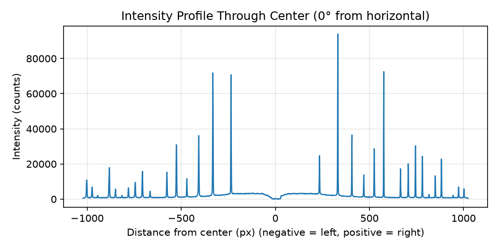
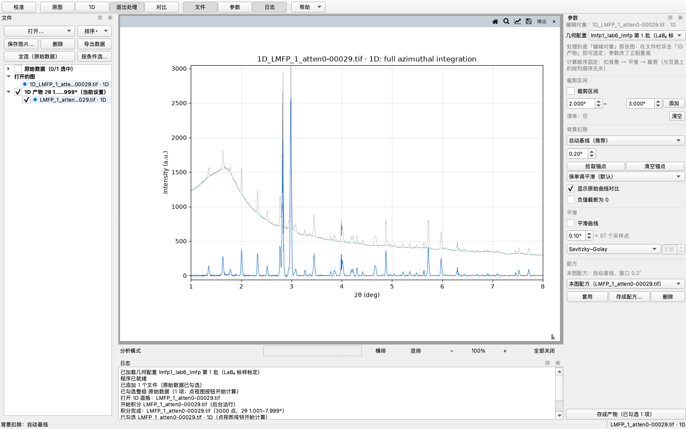
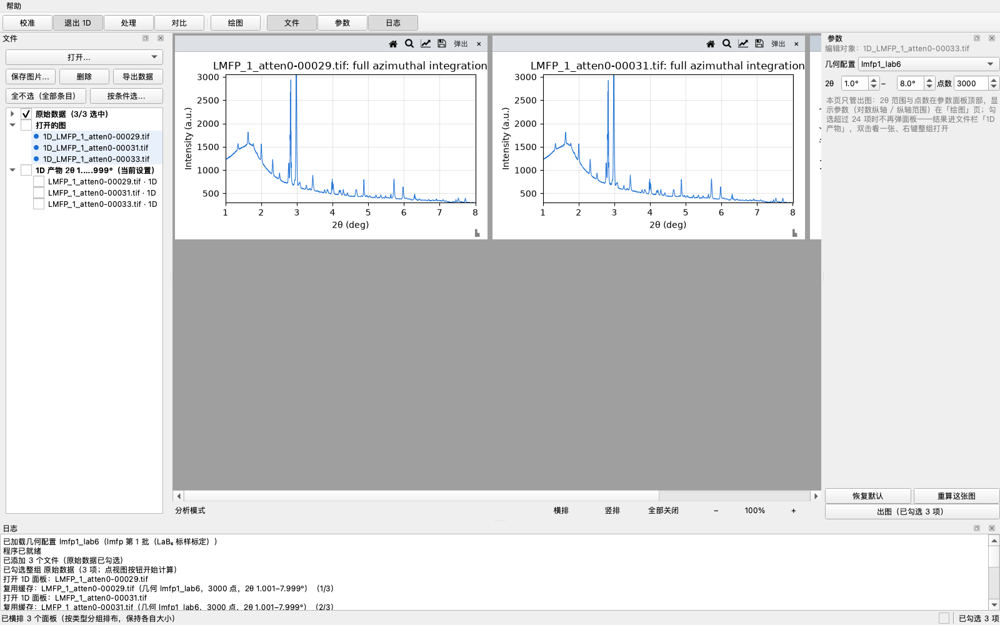
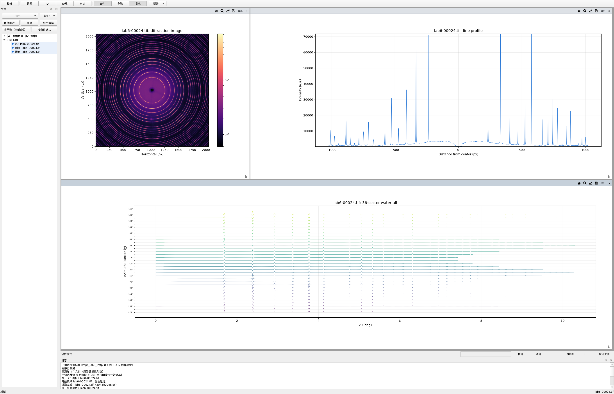
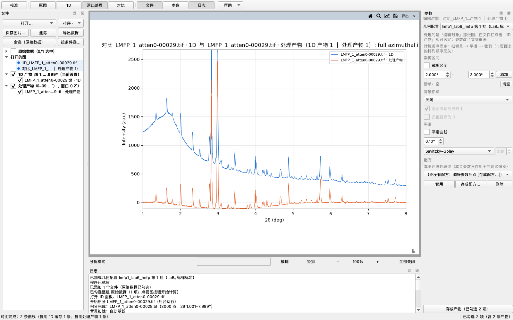
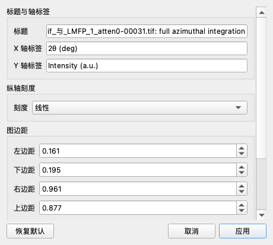

# XRD Toolkit — the long version

Everything that used to be in the README and made it unreadable: CLI flags, how the
calibration numbers are judged, how background subtraction was chosen, how batches and
product caching work, and the engineering notes behind the GUI. The short version is
[README.md](../README.md) · 中文：[NOTES.zh-CN.md](NOTES.zh-CN.md)

## CLI flags

All four scripts accept `--file` to pick one dataset, or — without it — an interactive
menu listing everything in `data/` (number selection, `1,2` multi-select, or `all`).
Outputs land in `{outdir}/{dataset}/`, where `outdir` defaults to the **absolute
project `outputs/` folder** (since 2026-10-02; it used to be a relative path that
followed the process working directory — starting from elsewhere silently wrote
elsewhere; passing `--outdir` explicitly behaves as before). The three consuming
scripts take `--config NAME` (default `lmfp1_lab6`); in interactive mode a second menu
asks for the config after the files are chosen. The txt files share one writer with the
GUI export (`services/export.py`, see *Data file format* below).

<details>
<summary><b>View a diffraction image</b> — <code>scripts/view_diffraction.py</code></summary>

```bash
python scripts/view_diffraction.py --file data/xxx.tif --angle 0 --outdir outputs
```

- `--file`: diffraction image path (.tif / .edf / .cbf)
- `--center`: ring center `cx,cy` — defaults to the beam center of the selected config
- `--config`: geometry config name from `config.py` (default `lmfp1_lab6`)
- `--angle`: profile angle in degrees (default 0)
- `--outdir`: PNG output directory (default: the project's `outputs/` folder)



</details>

<details>
<summary><b>Geometric calibration + 1D pattern (LaB₆ standard)</b> — <code>scripts/calibrate_integrate.py</code></summary>

```bash
python scripts/calibrate_integrate.py --file data/xxx.tif --wavelength 0.1223 --pixel 200 --dist0 1600
```

- `--wavelength`: X-ray wavelength (Å)
- `--pixel`: detector pixel size (µm)
- `--dist0`: initial detector distance (mm) — refined automatically by pyFAI
- `--center`: initial ring center `cx,cy` in pixels (default: auto-localized, < 1 px accuracy). Pass it explicitly for off-center-beam (partial-ring) datasets: the auto-localizer needs full rings, and refinement is unreliable there — calibrate distance/tilt on a centered standard image instead
- `--max-rings`: number of LaB₆ rings used for calibration (default 16)
- `--range`: 2θ range — `full`, `auto` (default, per-material standard), or `lo,hi` degrees (e.g. 1.3,7.3); the full txt is always saved
- `--outdir`: output directory (default: the project's `outputs/` folder)

Pipeline: LaB₆ peak-position calibration (pyFAI `GeometryRefinement`) → azimuthal integration (2D → 1D) → writes `calibrated_2th.txt` + `calibrated.png` (red dashed lines = theoretical peak positions). Code in `xrd_toolkit/services/integrator.py`. After refinement, a copy-paste-ready `CONFIGS` entry is printed so the new batch can be registered in `src/xrd_toolkit/config.py` (the script never writes that file itself).

</details>

<details>
<summary><b>Full-angle integration (2D → 1D standard pattern)</b> — <code>scripts/integrate_pattern.py</code></summary>

```bash
python scripts/integrate_pattern.py --file data/xxx.tif
```

Integrates 0°–360° with the geometry of the selected config (default `lmfp1_lab6`, e.g. 1595.80 mm) and writes a two-column txt (2θ(deg), intensity) + PNG. Override with `--dist`, `--poni`, `--wavelength`; `--range full/auto/lo,hi` controls the 2θ interval of the plot and the `_auto` trimmed txt (full txt always saved).

</details>

<details>
<summary><b>Sector integration + waterfall plots</b> — <code>scripts/sector_waterfall.py</code></summary>

```bash
python scripts/sector_waterfall.py --file data/xxx.tif --n-sectors 36
```

Splits the 0°–360° azimuth into N sectors (default 36, one per 10°), integrates each sector separately (geometry from the selected `--config`, default `lmfp1_lab6`), and writes per-sector two-column txt files under `outputs/{dataset_name}/sectors/` plus a raw-intensity stacked waterfall plot (36 curves offset along the Y axis with **one row height for every row = the second-highest row's peak × 0.7**; each curve is drawn until its own intensity drops to zero, so the staircase right edge marks where each sector's ring is clipped by the detector). Large grains or preferred orientation show up as intensity concentrated in a few sectors. The row spacing deliberately does *not* follow each sector's own peak — that would rescale every row to its own height and kill the sector-to-sector comparison (the rule, set 2026-09-26: "don't normalize by each one's own peak, in any figure"). **On 2026-10-02 the base moved from "the overall maximum" to "the second highest"** (user: "瀑布图……还是不行，改成行间距小一点，让峰明显一点"): on this LMFP batch the overall peak is 48230 (the 2.83° main peak in the χ=165° sector, 3.3× the runner-up) while the median sector's peak is 2586 — 5.4% of it. At 0.7 × overall maximum the median row's peak occupied **8% of a row**, so the whole plot read as a stack of flat lines; with the second-highest rule the step is 10327 (21% of the overall peak) and the median row's peak covers 25% of its row — visible at a glance, while only the strongest sector pokes into the row above (it *is* 3× stronger). Ignoring exactly one outlier is enough, a uniform sample gives second-highest ≈ maximum (so the old behaviour is preserved), and it holds for few rows too (a two-file compare). One implementation, `services/stacking.row_step`, shared by the GUI waterfall, the compare stacking and this script. The GUI's waterfall follows the same rule — with a manual override since 2026-10-07 ([手动行距] + multiplier in the Draw page's 「瀑布显示」 section, display-only and live) — and additionally runs the processing chain (background / smoothing / cut) on every sector, so cutting the giant peak that squashes the rest is what makes weak sectors readable. Supports `--range full/auto/lo,hi`.

</details>

## Calibration

The [校准] entrance opens the calibration page: its first block is the config-entry block — [编辑当前配置…] plus [加载几何…] / [保存几何…] / [删除] / [保存为配置] — sitting directly under the pinned geometry row, because those buttons act on the entry selected up there. Under it comes the three-column table: **current config** plus two comparison slots **A** and **B**, each selectable from everything produced so far, then two action blocks, 自动取点 (locate the ring centre and refine / 再精修 refine again from the current geometry) and 手动选点 (pick rings by hand: ≥ 3 points, ≥ 2 rings, ±0.5° snapping). **2026-10-05**: the two blocks used to read 自动 / 手动 with the second button named [在当前配置上再精修] — too vague; renamed to the labels above (result names follow: 自动取点1, 手动选点1 …). The same day the pixel-size confirmation turned from a **hard gate** into a **reminder** (calibration and saving proceed unchecked — an orange "⚠ 未核对" line stays visible and each run logs a reminder), and two scale-search defects were tracked down and fixed (`KeyError: 'poni1_px'`, and the winning scale not being handed to the final refit — commit `aaeeafc`).

The current config starts as the raw geometry prefilled from the selected entry; [编辑…] types values in or prefills from another entry, and any hand edit marks it 自定义 so nothing replaces it automatically. **Every result accumulates under its own name** (原始 / 自动取点1 / 手动选点1 / 精修1 …) and lands in a slot by rotation A → B → A — unless you picked that slot by hand, in which case it is pinned and new results stop overwriting it.

**Which geometry is in use: any result you pressed a button for becomes the current config** (user, 2026-09-30: "只要是用户操作的，无论自动手动精修都填入当前，让用户看到变化") — the cyan rings move right away, and the log states how much better or worse it is (`当前配置 → 手动选点1（环位偏差 0.50 px，比 预填自 lmfp1_lab6 的 0.20 px 差 0.30 px）`); replacing a hand-typed/edited geometry adds a note that the hand-typed one is still in the result list and can be picked back. The old threshold (win by more than 0.05 px of ring-position deviation — repeating the same image moves the fitted geometry by PONI 1.6–2.2 px but the ring deviation by only 0.014–0.029 px, so anything smaller is run-to-run noise) now only picks the *wording* (better / about the same / worse by X px), never whether the config is replaced: a threshold can be right and still leave the rings unmoved, which reads as "the refine did nothing". The calibration figure's title says the same thing on the plot: `Cyan rings = current config: <result> · ring deviation X px`. One reference drives both comparisons on the page, and it is **always the current config**: the Δ rows read "that column − current config" (the current-config column itself reads 基准 rather than a dash that looks like missing data) and the verdict judges both candidates **against the current config**, naming each side with its numbers — "A 比 当前配置 好 0.32 px（环位偏差 当前配置 0.73 px ｜ A 0.41 px）". This went through three states: originally the two were split (user, 2026-09-27: "对比基准和结论表述不清，不知道是谁在和谁比" — the base only moved the Δ rows, the verdict was hard-wired to 当前配置), then a baseline dropdown drove both (2026-09-28 #2), and on 2026-09-30 the dropdown was deleted outright (user: "直接把对比基准删了，直接出结论当前配置和 a、b 对比分别怎么样，随着用户选择 ab 当前进行变化") — swap what is pinned in A or B and both the Δ rows and the verdict move, with nothing left to explain about which pair is being compared. **A suspicious ring assignment is re-judged over distance scales** (2026-09-30). Clicking a ring identifies it by converting the click to 2θ with the *current* geometry and taking the nearest theoretical ring (±0.5°), and there is no ring below ring 0 — so a **distance off by a factor squashes the innermost real rings onto ring 0** (user: "如果第 0 青环里面套了两个真实的环，点击真实的环，里面的两个环都会标记为第 0 环"). The manual refine now checks first: if **one ring index spans two clearly different radii** (ratio > 1.15), it scans seven distance scales (0.85–1.20), re-identifies the rings at each, fits each candidate, and keeps the one with the smallest ring-position deviation — logging which scale won (only a ≥ 0.05 px win switches, the same noise rule as adoption). No image or no metric means no guessing: the assignment is left exactly as clicked. **Picking a point no longer redraws the whole figure** (2026-10-01; user: "校准功能卡死两次，都是在选点时"). A full redraw costs **~0.6 s** (2048² image through LogNorm plus resampling — measured at 610 ms per pick), and every pick used to pay it with the event loop held the whole time, so a few clicks in a row read as a freeze. Now one frame is cached as the backdrop (on `draw_event`, so it cannot go stale) and a pick just **blits** (restore_region + draw the new circle and number + blit — measured at 10 ms). **Every recorded marker has to be redrawn on each blit** (the user reported "圆环会消失" right after): the cached backdrop predates the blitted markers, so restoring it wipes the earlier points — the list `calib_marker_artists` is rebuilt by the full draw (`_draw_calib_image`) and each blit draws all of it. **Undo, clear and ring-index edits blit too** (the user's next report the same day: "手动选点的撤销和全清都卡了，就是变深色然后卡住" — they were still full redraws): the marker artists live **invisible** (`_new_marker_artists`), so the full-draw backdrop comes out clean and erasing an old marker is just "restore the backdrop, draw the survivors" — measured 8 ms for undo and 5 ms for clear, against a LogNorm pass over 2048² before. `draw_artist` ignores visibility, which is what makes the trick work (a probe screenshotted all three circles present). Actions that must erase an existing marker (undo, editing a ring index) still do a full redraw. Same trick as the panel box-zoom's `_blit_take`.

**A freeze leaves its own evidence now** (2026-10-01): if the UI thread stalls for more than 8 s, a daemon thread uses faulthandler to write **every thread's Python stack** to `outputs/hang-<timestamp>.txt` (and to stderr), then notes how long the stall lasted once it recovers; a stall that never recovers gets another dump every 30 s (stacks change while a hang grinds on — one frame is not enough). It **only records**: it kills nothing and pops no dialog. Reason it exists: the user reported "don't tick the pixel size, then clicking those output buttons freezes", and that path could not be reproduced here (offscreen, dozens of runs). A freeze is not something to guess at.

**A crash leaves its own evidence too (2026-10-03).** The user hit a hard crash while batch-processing 1D: the macOS crash report shows SIGSEGV inside PySide's teardown machinery (`method_dealloc → subtype_dealloc → ~QObject → disconnectNotify → Shiboken looking up the Python override`). History check: a crash with the **identical signature** on 2026-09-26 — not a regression, but a rare landmine in the background-task objects: a task finishing tends to drop its last reference **while its own slot callback is executing** (`_live_tasks.discard` in `_finish` plus the caller's `window._tasks.remove`), and the refcount-driven destruction then runs `~QObject` synchronously inside PySide's qtPythonMetacall — with the binding layer half-torn-down. The fix: both the task and its worker are now destroyed via **deleteLater** (posted from `_finish`; the worker's deleteLater lands in **its own thread**, since cross-thread synchronous destruction is just as forbidden), kept alive in `_live_tasks` until `destroyed` fires; `discard()` returns harmlessly for already-finished tasks. Added `watchdog.install_crash_dump()` (once per window): on SIGSEGV / SIGABRT / SIGBUS / SIGFPE the Python stacks of all threads are appended to `outputs/crash-watch.txt` (chain=True — the system report and termination are untouched), because the system report only has C frames and the Python layer used to be a black box. Also raised `scripts/stress_panels.py`'s watchdog from 40 s to 120 s: the healthy path takes ≈ 41 s for 10 rounds (measured ~4 s/round), sitting right on the old threshold and reporting a finished run as a hang.

**A greyed-out button has to say why** (2026-10-01; user: "手选完了点击用选点精修无效"). [用选点精修] needs ≥ 3 points covering ≥ 2 distinct rings; below that it is disabled — and Qt **drops clicks on a disabled button**, writing nothing to the log, which reads as "it does nothing". Now, when the *ring count* is what is short, the line above says the requirement and the way out: "已选 5 个点 / 1 个环——至少要 3 个点、覆盖 2 个不同的环才能精修（都判成同一个环号了？右键某个点可以改它的环号）" (probe: five points all snapped to one ring → disabled button, silent click; with the new text it explains itself). The button's tooltip states the requirement too.

**The fallback is a right-click**: right-click a picked point to **select** it (it gains a gold highlight ring) and edit its ring index in the 手动 section — a line saying "which point / currently judged as ring N", a spin box and [改]; the position does not move, and you press [用选点精修] to re-run. When every automatic pass has failed, you are the one who knows which ring that point is on. **On 2026-10-03 this changed from "right-click opens an input box" to "select, then edit in the panel"**: the user reported "the app freezes after a right-click renumber — buttons dim and stop responding", and live diagnosis (thread sampling + lldb) found the cause — **with the dialog open in native fullscreen, switching to another app and back leaves AppKit's modal teardown unfinished** (`NSApp.modalWindow` keeps pointing at the input box), so the window server blocks every keystroke and click from reaching the main window: the process is alive, the UI renders normally, and it just receives nothing ("dim" = how macOS draws the inactive window). An outside activation recovers it. The reproduction (fullscreen + native right-click opening the dialog + a real Cmd+Tab away and back) hits 100% of the time and never hits without the switch. After the change there is **no modal window anywhere on this path** — switching away mid-edit is harmless — and the dialog's old habit of hanging offscreen tests (which had to stub it out) is gone too.

**Page order and combo duplicates** (same day): the page now reads actions → 自动 → 手动 → **data** (you run first, read results after; user: "校准数据放最下，跟自动手动换位置"). The current-config dropdown inserts its display-only first entry **only when it does not point at a result** (hand-typed / prefilled) — when it does, the list holds that result once, fixing the user's "当前选中 2 在选项中还有 2".

PONI and tilt carry a ⚠ because they are degenerate with distance and wavelength, and the self-consistency residual is deliberately kept out of the table — it measures convergence, not accuracy.

The overlaid cyan rings are the *exact* rings the current geometry predicts: every point is reverse-solved from pyFAI's own 2θ map, so a tilted detector appears as the ellipse it really is — a plain "center + radius" circle would sit 8–23 px off, because the common center of the rings is the direct-beam spot, not the PONI. Point picking judges against that same geometry, so clicking a drawn ring cannot land on the neighbouring ring index, and if the geometry puts all 16 rings off the detector (distance / pixel-size / wavelength mismatch, or a wild refinement) the panel says so in red on the plot and in the log — ring radius range included, so the error factor is right there — rather than silently drawing nothing. **The view itself never moves**: it is always the image extent, so the detector image stays the one fixed frame of reference while the rings move around it. Seeing where the rings went is a deliberate act instead — the panel's [看环全貌] toggle (off by default, reset every time the panel opens) stretches the view to fit the whole ring set; the image then shrinks to a small square in the middle, which is exactly what that switch is for.

**Engine metrics.** Every run reports the median ring-position deviation in px (with the pre-refinement initial value beside it), how many of the 16 rings came out complete, and the dispersion of the LaB₆ lattice constant back-solved ring by ring. These measure what the fit residual cannot — a run can report a 0.0000° residual while the rings sit ~10 px off the real ones (measured on a deliberately mis-picked point set), because the residual is a self-consistency number, not an accuracy metric. Ring-position deviation catches uniform geometry error; the lattice-constant dispersion catches per-ring mismatch (wrong ring index, distortion, a peak pushed aside). Distance and wavelength are first-order degenerate on a standard, so a distance error barely moves the dispersion — do not use it to detect one.

**Pixel size is a gate, and the metrics cannot check it.** Calibration is blocked until the pixel size is confirmed — and the confirmation comes back only when the pixel value actually changes. Distance, wavelength and pixel size enter only as a *product*, so a wrong pixel size still lands the rings perfectly while the reported distance (and everything derived from it) is off by that factor. Saving is gated the same way: [保存为配置] refuses (with a log line) until the box is ticked, because a saved entry gets used verbatim by other batches and by the CLI scripts.

**Entry points.** New batches start from the current config: prefill from another entry or type values in [编辑…], or import a .poni with [加载几何…]. The [编辑…] dialog edits the **beam centre rows too** (row / column in px — the two 束心 rows of the table); before 2026-09-28 it had no such fields and "prefill from an entry" copied only the seven geometry numbers, leaving the previous beam centre, even though the beam centre is the thing calibration moves most. A hand-typed or hand-edited geometry also **joins the accumulated result list** ("自定义1", "自定义2", …; user, 2026-09-28 #1): before, it lived only in the `current_geom` variable — no entry in the A/B dropdowns, gone as soon as you switched away, unusable as a comparison base; now it behaves like an auto/manual result, and re-selecting it restores the "custom" protection flag so the next automatic result cannot silently replace it. [保存为配置] stores the current config — prefilled, typed or adopted — together with its provenance (`derived_from`, `method`, `created`), as a named entry in a local user file outside git that instantly joins the geometry dropdown, is selected automatically, survives restarts, and is usable from the CLI via `--config`. The geometry dropdown itself sits in a row pinned to the top of the parameter panel, so it stays visible — and usable — on every entrance page; hover it for the pixel size / wavelength / distance of the entry in force, and the analysis pages are read-only where geometry is concerned: picking an entry is all they do. On the calibration page the dropdown keeps working (the tooltip adds that calibration follows the page's own "current config", not the entry picked here), because the buttons acting on it — [加载几何…] / [保存几何…] / [删除] — live on the calibration page. [保存几何…] writes the **current config** (the table's first column, hand-typed values included) as a standard pyFAI `.poni` exchange file (distance, center as poni1/poni2 in meters, pixel size, wavelength, tilt rot1/rot2; the optional mask path is not written — the engine has no mask support and the format has no mask field), and the log names which geometry it wrote; before 2026-09-28 it wrote the *selected entry* instead, so exporting right after a hand edit produced the old numbers ("改完保存，文件里是旧的" — user, 2026-09-28 #2), and [加载几何…] reads one back into a named entry. Imported or saved user entries can be removed with [删除] (greyed out for builtin registry entries): a confirmation dialog guards the removal, and the selection falls back to the default entry. **2026-10-07: the save form collapsed to a single 「条目名称」 box** (the user: "一个框，预填文件名的不含-后的长数字部分……旧条目也变成一条，key_备注的格式" — one box, pre-filled from the file name minus the trailing dash-digits; old entries also collapse to one string, in the `key_备注` format — and, asked which places, "都改，统一": all of them, unified). Entering calibration pre-fills the box from the sample file's name with the trailing "-digits" dropped (`lab6-00024.tif` → `lab6`; a name the user typed themselves is never overwritten, `calib._refresh_config_name_prefill`), and the CLI identifier is sanitized out of the name at save time (non-alphanumerics → underscores, a leading digit gets a `cfg_` prefix, `config_ops._sanitize_config_key`) while the remark is the name itself. **All entry displays are now one string, `key_备注`** (`config.entry_display`, written once when the two are equal): the geometry dropdown, the dock-top hover readout, and the load / delete / save logs and confirmations all use it (old entries keep storing key and label separately and render as the joined string; the closed dropdown clips a too-long tail — the drop-down list and the tooltip show it in full).

## Automatic 2θ range selection

`--range auto` (the default) picks the interval with one standard per material: the lower bound comes from the material's standard (first known peak − 0.3° for powder samples; detected halo end − 0.6° ≈ 1.0° for the LaB₆ standard), the upper bound is detected where the data starts failing.

The failure criterion is **relative arc coverage** — the ring's fraction of azimuth inside the detector falling below 50 % of its own maximum — so one criterion adapts to any beam placement: ≈ 7.9° for a centered beam (the old 80 % absolute criterion stopped at ≈ 7.44°), and automatically later for off-center beams. Single-curve scripts use the exact geometric value; the waterfall's sector-based measured value lands ≈ 0.5° later (10° sector quantization) — the two are cross-checked and a warning fires only on a real mismatch. The full-range txt master copy is always saved.

## Off-center (partial-ring) beams

Datasets recorded with the beam deliberately placed at the detector edge or corner (each ring only partially captured, revealing higher-2θ rings) are handled end to end: a built-in numpy polar integration takes over automatically when pyFAI's radial binning becomes unreliable (pyFAI bins relative to the detector center, verified on synthetic rings), sector χ labels report the actually covered azimuth span instead of a fake 360°, and the waterfall statistics average only over sectors with real signal. Calibration on such datasets should be done on a centered standard image (distance/tilt are instrument properties); `--center` documents this.

## Processing (background / smoothing / cut)

The 处理 page carries three steps. **All three are optional** (unticked = not applied), all three redraw
live as you change them (milliseconds — no re-integration), and all three go to the whole batch through
[批量处理], landing in a 处理产物 … group in the file bar.

**The order is fixed: background → smoothing → cut.** Two boundary reasons: anchors are sampled *before*
the cut (an anchor inside the cut window would sample a blank and take the whole baseline with it), and
smoothing never sees a hole (smooth the complete curve first, punch the hole last — the other order needs
"half the window is blank" edge handling, which quietly makes every image's edges slightly different).

| Step | What it does | Knob |
|:---|:---|:---|
| Background | removes the additive part carrying no structure (empty scan / auto baseline / manual anchors) | see the next section |
| Smoothing | two methods: **rolling average** (default) / **Savitzky–Golay** | window width in **degrees** (not points, so it survives a change of output point count); SG also takes a polynomial order (2–3 in practice) |
| Cut | punches chosen 2θ intervals out of the curve (the plot shows gaps there) | start/end 2θ plus [添加] — the list holds **as many intervals as you like** (e.g. 2–3° and 7–8° at once) |

**Choosing between the two smoothers** (measured on the LaB₆ standard, same 0.30° window): the rolling
average takes the strongest peak down by **90.6 %** and widens its FWHM from 0.18° to 0.31°;
Savitzky–Golay takes it down by only **82.3 %** and leaves the FWHM at 0.18°. So **use SG when peak
shape, height or width matter**; the rolling average is the faster, simpler choice when you only want
the curve to look clean. SG's price: against a steep edge (the low-angle hump) it can push slightly
below zero — worth watching when you read background levels.

The cut list is the authority (window-level). Ticking 「裁剪区间」 with an empty list adds the interval
sitting in the two spin boxes — filling them in and ticking the box is the natural gesture — [添加]
appends another, [清空] takes them all back. Duplicates collapse, and a start ≥ end is refused with a
message rather than silently doing nothing.

**The cut blanks values, it does not delete points**: samples inside the window become NaN, so the 2θ grid
and every array length stay put (compare / heatmap / CSV alignment is untouched). All three consequences
are intended:

- the plot **shows a gap** there (matplotlib breaks the line at NaN) and the automatic y-range **skips it** —
  which is the whole point when one giant peak squashes everything else;
- the processing product has the same gap, the exported txt/chi **omits those rows**, and the file header
  records `chain: …` and `cut: N points removed`;
- the CSV summary leaves those cells **blank** (not 0 — a zero would be read as real intensity) and marks
  the affected columns in its `# blank cells` line.

**The product key = 1D product key + hash of the chain** (background, smoothing and cut together). With
smoothing and cut off, that hash is **bit-identical** to the old background-only product, so upgrading
never invalidates previously stored products. The group name states what the batch went through
(处理产物 09-25 16:40（锚点 5 个（覆盖 1.29–2.7°）、窗口 2°、平滑 0.15°、删 2–3°）) — the anchor entry carries
the span the anchors actually cover, because outside it the baseline is *inferred*, not measured — and the product metadata carries a
machine-readable chain (`bg=anchor(n=5)/win=2 → smooth=boxcar/0.15° → cut=2–3°`) — any product can
explain how it was made.

**The one-line model**: a 1D product is the integration's result, a processing product is the processing
result, and Compare / Heatmap / export read the processing product when there is one (saying so in the
log: "处理产物 N 条"). What you see on screen is produced by the same function that writes the file.

**Three buttons at the foot of the page** (exits added on 2026-09-28; 重画 deleted on 2026-09-30):
**重算这张图** — called 按 2θ 重算这张图 until 2026-09-30, same name and same action as the 1D page's
button (re-integrate the edit target with the
2θ range / point count from the top of the panel — the 2θ range is an *integration-time* parameter and the
processing chain only ever eats the curve it is handed, so before this button existed the processing page
offered no way at all to make the data follow a range change, which reads as "the 2θ range does nothing
here"), **存成产物** (formerly [采用这份结果]; store the processed curve currently on the edit target as a product and let it
appear in the file bar's 处理产物 … group — one file, one ledger entry, no need to check the file and go
through [批量处理]; user, 2026-09-28 #4), and **批量处理（勾选文件）**.

**"Redraw" is not a button any more** (2026-09-30). [重画] on this page ran `_refresh_proc` — the very
path that fires automatically on every processing-control change — and 绘图's [只重画，不重算] shared its
implementation with each panel's [复位视图]. Both were duplicate entrances, so both are gone. The workflow is
now one sentence: **parameters redraw live → zoom with the magnifier / wheel → [保存图片…] (which stores the
canvas as it stands)**; overshoot and press a panel's [复位视图] to pull the view back (it moves the view
only, never the settings). The zoom window is still written back into the panel snapshot, so a redraw
triggered by a parameter change will **not** reset a view you have zoomed into. The Draw page's two other
duplicate entrances went the same way on 2026-10-01 ("都删了，保存图片在图片自身的工具栏有"): [导出图片…]
was the same act as a panel's [保存图片…] and the close-window prompt (the batch saver `_save_figures` still
exists, it just no longer costs a button), and [清空缓存] was the file bar's right-click 「删除所有缓存…」
under another name (that one stays — it asks for confirmation first). The Draw page now has exactly one
product button, [出图].

**Each entrance button has two faces** (2026-10-01): the active one reads **「退出某某」** ([校准] →
[退出校准], [1D] → [退出1D], …) and the others read their plain names — the label itself says how to get
back, and pressing it again leaves. The 5707a6f build had exactly this for [校准]; it was dropped on
2026-09-26 when the panel-top [退出校准] arrived, and now all five share one implementation
(`_highlight_entrance`, which also swaps the tooltips). For the four analysis entrances "leaving" means
**back to the nothing-selected startup state**: every entrance unlit and the parameter panel collapsed (the
[参数] toggle brings it back any time) — no plot or product is touched. [校准] keeps its old meaning:
close the calibration panel and flip back to the last analysis entrance.

**A 2θ range and a cache key are the same thing, and nothing may mix them up** (a real bug found by the
same feedback): when [批量处理] needed a raw file's curve it used to prefer the in-memory panel curve and
**ignore the current 2θ range entirely** — integrate a panel at 1–8°, set 2–7°, batch, and the product was
written under the 2–7° key while holding 1–8° data (key and data disagree, and a later 2–7° lookup still
"hits" it). Now only a curve matching the *same key* counts (the panel's snapshot is turned back into a key
and compared with the lookup key); otherwise it reads the 1D product, and if that is missing the file is
**skipped with the reason spelled out** ("面板里那条是按 2θ 1–8° 算的，按当前设置还没算过（现在填的是
2θ 2–7°）").

## Background subtraction

The parameter panel's 背景扣除 section removes what carries no structural information: air scatter, amorphous diffuse scattering, fluorescence, detector dark current, beam-stop halo. It matters here: both samples' background rises 3.8–5.2× toward low 2θ (LMFP 1429 counts at 1–2° vs 275 at 9–10°), so a constant offset cannot work.

Three modes, every one previewed live (parameters change the drawing only — the cached raw curve is never touched, so nothing re-integrates):

- **empty-scan subtraction** — subtract a blank measurement, with a normalization factor for differing exposure/beam current;
- **auto baseline** — rolling-window level estimate; set the window to 3–10× the widest peak's width (the local-linear stage below widened the usable range from "around 1°" to 0.5–3°). **Default 0.5°** since 2026-09-26, down from 1.0°: on the LMFP data a 1° window left the broad amorphous hump (1.6–2.6°) behind as a residual (median 34, max 527 counts), because that hump is wide enough to look like structure to the estimator — 0.5° takes it out (residual median −1, max 322) while the giant peak keeps its height (2510 → 2516); 0.1° removes it too but rides the peaks harder (baseline 211 counts up under the giant peak vs 142);
- **manual anchors** — click points that are background only; between anchors the baseline joins them with a **monotone-preserving smooth** (pchip: exact through the anchors, smooth, no overshoot); a polyline (the lab convention) and a natural cubic spline (can overshoot) are also available. **Beyond the outermost anchor the anchors set the level and the auto baseline supplies the shape** — the baseline continues as the automatic curve shifted to your nearest anchor. It is no longer extrapolated as a straight line: that slope came from the last two anchors, and when a user clicks twice near the same spot those two points can be 0.02° apart, which turns a dozen counts of noise into hundreds of counts per degree — multiplied over the several degrees to the end of the data this lifted the baseline by thousands of counts and tilted a whole batch (68 of 81 files, 2026-09-27). With no auto baseline to borrow, the ends simply hold their anchor value: under-subtracting at the low angles is visible and fixable with another anchor, an over-subtraction is silent and ruins every intensity.

**The auto baseline's two stages, and why stage 2 is now a line fit.** Stage 1 takes a low percentile inside the window — a floor that peaks cannot lift, deliberately on the low side. Stage 2 turns that floor into a *level at the window centre*, and on 2026-09-26 that changed from "mean of the un-masked points" to "**least-squares line through them, evaluated at the centre**": on a steeply decaying background the mask throws away the window's high side, so the mean lands below the truth and the low-angle end is systematically over-subtracted (measured against a synthetic truth: −139/−163/−533 for windows of 1°/2°/3°), while a local line has no such bias (+3.7/+1.0/−9.3, mean absolute error 42→35, 63→46, 94→67). The implementation is vectorized — the mask is a per-point criterion, so prefix sums plus a 2×2 normal-equation solve do all windows at once (100 000 points in 21 ms).

**The y axis does not follow the background.** While subtracting, the 1D panel's automatic y range is computed from the *un-subtracted* curve (the subtracted one only raises the upper bound), so each anchor or window change leaves the frame alone and only the curve moves down inside it. Computing the range from the subtracted curve made the whole plot rescale on every click — it reads as "the picture is jumping around".


The compare panel's y range follows the same rule (2026-09-26, after the 1D fix): it is framed by the curves with the background and smoothing **left out** — but *with* normalization (that is what changes the scale on purpose) and *with* the cut intervals blanked, so cutting a giant peak still frees the axis. Tuning the background then leaves the frame alone; the one deliberate move is the lower bound dropping near zero the moment the subtraction is switched on, so the subtracted curves are not clamped at the frame's edge.
**Anchor fits, measured** (synthetic truth: steep decay + 6 peaks + σ=12 noise, 5 anchors): monotone-preserving smooth 6.1 mean absolute error, natural spline 16.4, polyline 28.8 (with only 3 anchors: 50 / 99 / 118) — hence the new default.

While subtracting, the 1D panel overlays the raw curve (dashed) and the baseline (dotted) on the subtracted one, so before/after is visible as you tune. Anchors are stored per file; Compare / Waterfall / Heatmap apply the same settings (the waterfall subtracts one common sector-mean baseline so sector-to-sector intensity differences survive), and [导出数据] can write the subtracted curves. Negative values after subtraction are kept by default — the noise floor is real, and clipping it at 0 biases the mean up by ~1σ — with an opt-in checkbox to clip.

SNIP was implemented and measured as well, but it over-subtracts by 43–98 % on these patterns (it clips the broad amorphous hump at ~2.2° as if it were a peak), so the GUI does not offer it.



## Batches, products and the file bar

**Batching.** [打开文件夹] imports a whole folder (every .tif/.tiff/.edf/.cbf inside, duplicates skipped automatically — or just drag a folder onto the window), and any view button processes all checked files at once, with a live progress counter in the log and in a status-bar progress bar (completion lines end in （k/n）; opening the panels themselves reports progress every 8 panels and keeps the window responsive). Check more than **24** files and the batch draws **none** of them (the user's rule, 2026-09-26, "防爆图"): opening a panel is the one cost that grows with the count (136 ms for the first, 287 ms for the hundredth) and each costs ≈ 15 MB, so instead the whole batch is integrated in the background and stored, and the results land in the file bar's 1D 产物 group — **double-click an entry to open that one, or right-click the group for [打开整组]** (which asks first when the group is larger than 24). Batches of 24 or fewer draw every panel as before. Large batches merge their log lines (one line for the openings, a progress line every 8, one summary with the elapsed time and how many came from the cache) — 81 files used to print 162 lines. [导出数据] saves each file's 1D product as a two-column txt / `.chi`: **a single dataset = one flat file** (no folder, e.g. `outputs/lab6-00024_处理产物.txt`), **two or more = one `导出_<timestamp>/` folder** containing the `全部数据.csv` collection plus a `txt/` subfolder with one file per curve (user, 2026-10-02). The collection is optional (checked by default; when 2θ grids differ, a dialog offers the common intersection with re-interpolation, skipping the mismatched files, or cancelling). A single failed file never aborts the batch, and the log gets a start line and a completion line carrying the elapsed time and the full path.

**Data file format (2026-10-02 standard).** The header states what the curve **is** and what was done to it — mirroring the GUI's 原始数据 / 1D 产物 / 处理产物 categories as `Raw` / `1D product` / `Processed` — and is **always pure ASCII**: `° – → 、` are exactly what Excel garbles when it opens BOM-less UTF-8 (the user's 2026-10-02 report of mojibake on CSV lines 2/3); chains are transliterated by `process.chain_ascii` (`°`→`deg`, `→`→`->`, `–`→`-`, `、`→`,`). Curve files (txt/chi; GUI and CLI share the single writer in `services/export.py`) look like:

```text
# 2theta(deg)  intensity
# data category: Processed
# chain: bg=auto/win=0.18 -> smooth=boxcar/0.15deg -> cut=2.7-3,2.7-3.1deg
# cut: 171 points removed
# points: 4245  range: 1.001-5.900 deg
# config: lmfp1_lab6
# exported: 2026-10-02 22:55:03
```

No processing is stated too (`chain: none` + `cut: 0 points removed`) — there is nothing left to guess. The `全部数据.csv` collection is written as utf-8-sig (BOM: column names may contain `_处理产物`, and without a BOM Excel garbles the comment/header rows). The `# exported:` / `# column N: …` detail block sits **on top**, directly followed by the `2theta(deg),<names>` header row and then the data — the user asked for it on 2026-10-03 ("2theta and the names are not next to the data"): with 81 columns the old layout inserted 81 comment lines between the header and the data, so one scroll in Excel broke the alignment. Read it with `pd.read_csv(path, comment='#')`; the old `np.loadtxt(skiprows=1)` recipe no longer applies (the number of comment lines varies with the column count). Cut cells stay blank, and the batch folder name now carries a content tag (`导出_…_原始/` / `_1D产物/` / `_处理产物/` / `_混合/`). The output folder is pinned to the **project `outputs/`** (`xrd_toolkit.paths` is the single definition, overridable with `XRD_OUTPUTS`) — export / figure saving / `.poni` / the freeze watchdog used to resolve the relative `Path("outputs")` against the process working directory, and one PyCharm run (working directory = `src/xrd_toolkit/gui`) grew a second outputs folder inside the source tree; the two were merged back together on 2026-10-02. Old files on disk (`*_处理后/` folders, the old `1d_summary.csv`) are left as they are. Full spec: [UI_COPY.zh-CN.md](UI_COPY.zh-CN.md) §7.

**Selecting what to process.** Imports start out unchecked (200 files should be your call, not the app's): one select-all / select-none toggle whose label spells out the scope of each direction (user, 2026-09-28 #3, who asked about the asymmetry: "全选只全选原始数据，全不选会包含产物") — **[全选（原始数据）]** checks the raw group (check product groups by clicking their own group row: the checked set is the input to plotting and batch processing, so sweeping products in would silently double it), **[全不选（全部条目）]** clears the whole tree (clearing is "back to zero", and zero should be thorough) — plus [按条件选…], which takes a range (from the i-th to the j-th), a stride (every n-th, with a start offset) and a case-insensitive name filter (substring; it intersects with the other two), optionally appending to the current selection so you can build one across several ranges. The dialog previews the count live.



**Staged-product cache.** Integrated 1D curves are written to `outputs/_stage/` (local, not in git) and reused across sessions, so re-opening a batch the next day does not re-integrate everything (measured on three files: 1.4 s → 0.4 s; extrapolated to 81 files, 38 s → 10 s). The key is the file fingerprint (name + size + mtime + head hash) + geometry entry + 2θ range + point count + an **integration implementation version** (bump it and old products retire themselves). A hit is always logged ("复用缓存：…") — silent reuse is how you end up trusting the wrong numbers. Clearing the cache lives in the file bar's right-click menu ("删除所有缓存…", behind a confirmation) — the Draw page's [清空缓存] button went away on 2026-10-01, together with [导出图片…] (saving a figure is the panel's own [保存图片…], and the close-window prompt).

**Background products.** [批量扣背景（勾选文件）] applies the current figure's anchors to the whole batch — the anchors carry **only their 2θ positions**, the intensities are re-sampled from each file's own curve (a batch shares the background *shape*, not its absolute level; copying the intensities would lift another file's baseline by a factor). Each result is stored, and the Compare / Heatmap views read those products first, saying so in the log ("扣背景产物 N 条"). Changing a background setting does not invalidate anything by hand: the product key contains the settings hash, so a change redraws live (milliseconds) and only an unchanged recipe reads the product.

**Colors live with the figure they belong to.** The 2D panel's colormap was hard-coded to magma; 「外观」 now carries a 「色图」 dropdown for 2D panels (per panel, stored in its snapshot, redrawn on apply), alongside the per-curve colors it already had for Compare. The rule of thumb: *this figure's* colors in 「外观」, *new figures'* defaults (the curve palette) on the parameter page.

**The parameter panel pins three rows** above the page stack: the edit target, the geometry entry, and the **data parameters — the 2θ integration range and the point count**. The range used to live only on the 1D page, so picking one for a Compare or Heatmap run meant walking back there first (user, 2026-09-27); as data parameters they belong with the geometry row. **Since 2026-10-03 the row shows only on the pages that actually fetch with it (1D / 处理 / 绘图): the calibration page hides it** — calibration never reads a 2θ range (the user's follow-up: "校准页参数放 2theta 范围干嘛") — **and so does the compare page**: "对对比图改 2θ 会影响所有参与对比的图，这不合适" ("changing the 2θ on a compare affects every figure in it — that can't be right"), and then "对比页不起作用就藏起来" (if it does nothing there, hide it). Compare/heatmap no longer fetch from that row at all: each file uses **its own last-used range / point count** (`plot_views._file_data_params`, the same per-file memory as option 甲) and the views draw what is already computed — computing a missing one at that file's own settings — so "taking a look at a compare" no longer re-integrates a whole batch, nor writes that range into each file's memory. In support: the data keys stay out of the compare/heatmap panel snapshots (`plot_compare._aggregate_snapshot`), so focusing a compare neither replays nor writes the dock row (going back to the 1D page does not show the compare's range), and `_display_snapshot` was changed to stay within the given snapshot's key set — it no longer resurrects keys a figure deliberately does not carry; while the geometry row stays there because it is both the prefill source and what [加载几何…] / [保存几何…] / [删除] act on. The 1D page's *view* range moved to the Draw page's 1D display section (it is a display parameter, and on the 1D page it sat directly under the integration range looking identical — the user, at that point: "1d 参数页两个范围。。。"), so the 1D page now carries exactly one range, and the two honest meanings live in different places: the integration range up top (changing it re-integrates), and the view range, which is now **zoom and pan only** — the user's call ("显示范围用户自己放大就行了") — so that pair of boxes is gone (the keys stay: zoom/pan writes them, [恢复默认] resets them to follow; `_param_box_set` skips the box when there is none, and `_display_snapshot` carries widget-less keys over from the old snapshot so [应用] does not quietly drop an explicit view range). The heatmap's display controls (colormap, log intensity, normalization) now redraw **as you change them** — they were wired to nothing before, so a drawn heatmap could not be recoloured at all. **The compare display parameters (normalization / normalization target / curve palette / stacked display) went live the same way on 2026-10-02** (`_refresh_compare`, wired like the heatmap's): the user reported "堆叠显示无效", and the drawing side turned out to be fine all along — the problem was *reach*: those four controls live on the 对比 page while [应用显示设置] and the "未应用" grey label live on the 绘图 page, so ticking [堆叠显示] there had nothing that could put the change into effect (and no grey label either), which reads as "I ticked it and nothing happened". The four are therefore off the apply-to-take-effect list (`_PENDING_GROUPS`) and now redraw every compare panel immediately (compare is a single-slot panel, so usually one). The [堆叠显示] tooltip was fixed in passing: it still promised "each curve lifted to its own row by its own peak", a rule the user killed on 2026-09-26 (the code uses one uniform row height; since 2026-10-02 that height is the second-highest row's peak × 0.7 — see the waterfall section and `services/stacking`). **2026-10-05**: a **[手动行距]** checkbox sits under [堆叠显示], with a multiplier box that enables when it is ticked (the user: "对比的堆叠添加让用户自己改 y off") — row height = automatic height × multiplier (0.1–10, default 1.00); display-only, live, and unticking it returns to the automatic rule. **2026-10-07: the waterfall side is wired** — its own [手动行距] + multiplier live in a new 「瀑布显示」 section on the Draw page (the keys carry a 瀑布 prefix, so each page owns its pair and its own figures), live via `plot_views._refresh_waterfalls` (which writes only those two keys — packing in every display control would drag the edit target's palette onto all waterfalls). The same day the heatmap's **"2θ view"** came back, in the user's own words "就是重看，不是重算" (re-view, not recompute): a **视图 2θ** box pair in the heatmap-display section, bound to the same keys zoom/pan already write — typing crops and redraws at once (`plot_compare._refresh_heat_view`; only the xlim changes, the data is untouched), and a zoom/pan on the figure syncs the boxes back. "Follow the integration range" (None) stays meaningful: `_display_snapshot` no longer captures these two controls (their boxes often display a *derived* follow value, and capturing it would pin follow into an explicit window that later mis-crops a re-integrated curve); values actually typed are written back explicitly by `_refresh_heat_view`. Whatever lies beyond a file's own computed range simply shows blank — no data is drawn for it, and nothing recomputes.

**An edit that is not in force yet now says so** (user, 2026-09-30: "参数页显示本图的参数……如果用户改了，添加一个灰字未应用来区分，切图再切回来保持"). The panel always shows the **edit target's** parameters; change the 2θ row (in force only after [重算这张图]) or a display parameter (after [应用显示设置]) and that row raises a grey **未应用** marker — "the figure is still the old one" is visible at a glance rather than a mystery. The edit is remembered **per panel**: switch away and switch back and the value is still there, marker and all (before, the snapshot replay wiped it silently). The marker measures "controls vs the panel's in-force snapshot", so pressing the apply button puts it out by itself. And **typing values to plot a new figure is not a pending edit**: fill in 2θ = 2.5, press [出图], and 2.5 was an *instruction* to the new figure — already used up. Without that distinction, switching back to the earlier figure would sprout an "un-applied" value out of nowhere (two older tests failed exactly that way, which is how the rule got written down). While an auto switch is on (auto y-range, auto contrast, auto heat range) its paired limit boxes hold program-computed display values and never count as a pending edit — otherwise the marker would never go out (the probe hit exactly that). **Two follow-ups, 2026-10-03.** ① The marker had a stale-value bug: re-pressing [对比] / [热图] keeps the same edit target, so `_set_focus` returns early and nothing refreshed the label — the values were already consumed ("why is the un-applied marker still there after I clicked?") but the marker stayed lit; the data-fetch paths now refresh it themselves (`_run_compare` / `_run_heatmap`). ② **"One global 2θ" is over (option 甲)**: "the 2θ value being globally unified is wrong … when I processed raw data again it defaulted to the range I had just used for the compare." The dock row is whatever the last editor left behind, and a new figure inheriting it leaks another figure's range. A **new figure now starts from the file's own last-used range / point count** (`stage_cache.last_range_for`: the newer of its 1D products and its processing-batch ledger entry; a lazy index invalidated by a write generation), and a file that was never computed falls back to the factory defaults (`panel_state.DATA_PARAM_DEFAULTS`, 1–8 / 3000). A value typed but not yet consumed is still an instruction (the `_pending_consumed` marker — snapshot replays no longer mis-mark it, see `_connect_pending_hooks` respecting `_param_replaying`), and multi-file batches (≥2) still use the dock row — a group needs one common range. The memory stores the range at the boxes' own precision: curve endpoints 1.001–7.999 round to 1.0–8.0 (one extra integration for that file, stable after that).

**The background recipe is per file.** [批量处理] used to write the chosen mode and window only into the panels that happened to be open (the anchors were already stored per file): subtract file A, batch it, then open file B and it reads "no subtraction" even though B has a product. The recipe now lands in `proc_recipes[path]` for every target, with `anchor_source` naming the file whose anchors it borrowed, and the processing page shows it as one line ("本图配方：自动基线、窗口 0.3°、锚点 21 个（覆盖 1.29–2.70°）…（锚点来处：a）"). **It is a record, not an action**: opening a raw file draws *raw* data — the earlier version seeded the panel's snapshot from the recipe, so a file that had been through the batch looked processed the moment you opened it, which the user reported the same evening (2026-09-27). Applying is explicit ([套用]), or you look at the result through the file bar's 处理产物 entry. The same shape is what a **saved recipe** holds: [存成配方…] (renamed from [保存为配方…] on 2026-10-02) writes mode / window / anchor *positions* / smoothing / cuts to `outputs/recipes.json` (see services/recipes), and any later batch can apply it — the anchor **heights** are always re-sampled on each file's own curve, which is the rule the batch has followed all along. That button, though, had **never once worked** before 2026-09-28: `app._save_recipe_dialog` called `_proc_settings`, a name that was never imported into that module — every click raised NameError with nothing in the log (the user reported "保存无效"; a probe reproduced it on the spot, and `outputs/recipes.json` did not exist before that day). Two display problems went with it: the recipe dropdown and the "本图配方" line were filled *before* the recipe was recorded (`_sync_bg_rows` runs ahead of `_refresh_proc`), so right after tuning a parameter the dropdown still held only the placeholder and [套用] answered "先在下拉里选一份配方" — it is refreshed as soon as the record is written now; and the dropdown's default selection is "本图配方（this file）", which *is* the set already on screen, so pressing [套用] on it changes nothing — pick an entry under "已保存：…" to see an effect. Applying a recipe **on a 处理产物 panel now redoes the file from the source curve** rather than being refused: the panel is switched in place to the 1D curve the product was derived from (lineage: `base_key` in the product metadata, falling back to the batch ledger's geometry / point count / 2θ range for older products), so "try another parameter set" is possible without ever subtracting a background twice (user, 2026-09-28 #3: "套用别的配方的处理图不能二次处理了，修正"). Anchors that fall outside a file's 2θ range are dropped and reported (clamping them to the end value is invisible and wrong). "Auto + manual correction" (user, 2026-09-27) is the same idea one level down: the auto baseline is corrected through any anchors you place — their residuals are spread over the curve with a monotone spline, so the baseline passes exactly through your points while keeping the automatic shape — which is why the anchor row is available in *auto* mode now, and why the default window moved with it (1.0° → 0.5° → 0.3°). **On 2026-09-28 the user took it down to 0.2°** ("默认值 0.3 改成 0.2"): on this LMFP batch 0.3° was still too wide (background-point residuals: median −1.5, 1st percentile −30, up to −889 at the peak wings — the wider the window, the more of a peak's wing gets flattened as "background"). What changed is the *default*, not the algorithm: `BG_ALGO_VERSION` is untouched, so products computed at 0.3° still match their own keys and stay listed in the file bar; new panels start at 0.2°. **The three buttons at the foot of the processing page got honest names** (user, 2026-10-02 #2, who read [采用这份结果] and [保存为配方] as duplicates): they are not — [存成产物] (formerly [采用这份结果]) keeps **data** (it lands the curve in the file bar's 处理产物 group, where [对比] / [热图] / export can pick it up), while [存成配方…] keeps **instructions** (reusable on other batches); both old names simply sounded like "save". Each tooltip now names the other. **The recipe block moved to the very bottom of the page** (user, same day, "配方位置 最下方？"): a recipe covers the **whole chain** (background + smoothing + cuts), and it used to sit between the background and the smoothing sections, which read as "this only covers background" even though the smoothing and cuts you set *below* it were being stored too — the order fought the meaning. **One anchor can be deleted on its own** (user, same day): **right-click an anchor circle to remove just that one**, no need to switch [拾取锚点] on (the old path — pick toggle on, then left-click within 8 screen px of the circle — was invisible and tiny). Right-click was unused on 1D panels (the calibration panel uses it to pick a point for ring renumbering), it only deletes, and a mistake costs one click to re-add; the hit test is the same 8 px as the left-click path, and it only accepts anchors you can **see** (the circles are drawn in manual-anchor and auto+correction modes, see `_anchors_visible`). **2026-10-05, two items**: the processing page now opens with a permanent pointer — "处理对象就是上面的「编辑对象」：在文件栏双击「1D 产物」（或点开一张 1D 图）即可选定" (the user: "没选中面板就显示没选中……让用户看明白"; double-clicking a 1D product already opened its panel and set it as the edit target); and **a single file's 1D completion now lists 「1D 产物」 in the file bar immediately** — the refresh used to hang off the batch wind-up only (`_batch_step`), so a single file waited for the next unrelated action to "suddenly" appear (the user: "打开单张进行 1d 处理后在文件栏不显示，如果再打开另一张，就显示了"). The single-file refresh runs `refresh_groups_quiet`: the product is listed but it does **not** count as a "new product" and does **not** clear the checkmarks — otherwise the file you just checked gets swept away and even "click [1D] again to reuse the cache" becomes impossible (four tests caught this the moment the immediate refresh first shipped). **2026-10-07, the page order became cut → background → smooth** (the user: "最上方是裁剪-扣背景-平滑的顺序" — that is how they work: cut the giant peak that squashes the rest, then estimate the background, then smooth). It is **layout only**: a grey line at the top of the page now spells out "计算顺序固定：先扣背景，再平滑，最后裁剪" — the compute order is fixed in `services/process.apply_chain` (swapping it would change the data) and is unaffected by the page order. The recipe block stays at the very bottom.

**Outside the anchored span the residual is held, not extrapolated** (same rule as above — extrapolating it tilted 68 of 81 files in one batch, 2026-09-27), which makes the rule the same in both modes: *anchors set the level, the auto baseline supplies the shape*.

**The file bar is a tree** — the 原始数据 group on top, then one group per stage: **1D products grouped by their integration settings** (user, 2026-09-28 #4: "同一批原始数据出两组 theta 不同的 1d 图会掺在一起，应该有分组区分") — one group per settings set, the group name saying which one it is ("1D 产物 2θ 1–8°（当前设置）", "1D 产物 2θ 3–12° · 1000 点 · 几何 lmfp2_lab6"), with the current settings' group first; it used to be a single group distinguished only by a per-row tail ("1D（2θ 1–8°）") computed *relative to the current settings*, so changing the range in the panel moved the tail from one row to another and the two sets looked like they had swapped identities — and 扣背景 09-25 14:03（锚点 5 个（覆盖 1.29–2.7°），窗口 2°）… (one group per [批量扣背景], named with its time and recipe, so you can tell which parameter set a result came from). **Since 2026-10-07, "one batch" means one parameter set** (not one click): the batch id is the processing chain's parameter hash, **with no timestamp** — the same parameters clicked again, seconds or days later, update that same group (its name's time refreshes to the latest save, and the duplicate "· 第 2 组" from a same-settings re-click is gone: the old id carried a second-resolution timestamp, so a re-click one second later made a second group). **Different parameters clicked are different batches, kept side by side** (the user: "每次只有当前配置的一批进入文件栏……不同参数多次点击，那就都进文件栏"). Re-recording the same batch **merges its items** — a later click never strikes from the file bar an entry whose product is still on disk (the "nothing disappears except what you delete" rule, unchanged). **"Currently open" has its own marker** (user, 2026-09-28 #5: "文件栏背景加深代表这个图正在打开，选中未选中仅用框内的标志表示"): an entry with a live panel gets a light row tint *and* a solid dot on the left, while checked/unchecked is shown only by the checkbox — Qt's selection fill is switched off, since the old dark row meant "the row you last clicked" (and only while it was checked), which you could only guess at, while *which plots are open* was not visible in the bar at all. 81 samples' row names would otherwise smear into one black band: the heatmap strips each name down to its number run ("LMFP_1_atten0-00029.tif" → "00029") and thins the labels to the panel height, and the compare panel **drops the legend entirely past 12 curves** (a wall of 81 names covers the data — hover the status bar readout instead, which names the curve and whose dot takes the curve's colour). **Checking a group checks everything in it** (two states only — all checked lights the group up, anything else leaves it blank; the old half-check dash was indistinguishable from blank, so the user had it removed), so a whole batch of background-subtracted curves goes to [对比] / [热图] in two clicks. **Double-clicking a product entry opens that one 1D panel** (cache hit if it was integrated already) — a **raw** entry does not open on double-click: raw data can become any of the four views, so the click only says which buttons to use (user, 2026-09-27); the right-click [打开 1D 图] still opens one, since that gesture names the view. Right-clicking a group offers [打开整组 1D 图]. Right-clicking deletes: a product group (the whole batch, ledger and stored products together) or a single product entry — every kind of product can be removed from the file bar, and the 1D 产物 group is no exception. Groups are rebuilt only when something happens (import / delete, batch background, cache clear) — never on a timer. **A new product means the previous round is over, so the checks start clean** (user, 2026-10-01 #8, option "甲"): the rebuild compares the product identities `(kind, key)` seen on disk at the previous rebuild against the ones on disk now, and when new keys appear it clears the whole tree's checks (raw group included) and says so in the log — the checked set is the input to plotting and batch processing, and last round's selection should not stand in for this round's. A key that is merely re-registered (a new session, a rescan, importing a file whose products were computed long ago) is not a new product, and checks stay put. Rebuilds with nothing new still touch nothing (the 2026-09-28 rule that a rebuild must not move the user stands: scroll, collapsed groups and the current row are all preserved). **The 「打开的图」 group** (user, 2026-10-01 #5: "画图出的也放进文件区……比如对比、热图、瀑布之类") sits directly under 原始数据 and lists the **windows that are open right now**, one row per panel, added and removed as panels open and close: click or double-click raises that panel to the front and makes it the edit target, right-click raises it or closes it. Compare and Heatmap — the single-slot multi-file views — are visible **only here**, since they have no file entry of their own. Two rules (same day): **the calibration panel is not listed**, and these rows **are not checkable** ("things you look at" are not data: they have no checkbox, and select-all / select-none / conditional selection / group-state recomputation all skip them). What gets listed is the window itself, not a saved image file — images have no ledger and cannot be recomputed, so listing them would need a book of their own. **The aggregate views hold no memory of a previous selection**: [对比] and [热图] are single-slot panels rebuilt from the current checks each time they are pressed (their keys used to encode the checked set, so changing the selection opened a *second* panel and left the old one on screen — the user read the stale picture, saw 「二百多条」 for a selection of 81, and set the rule on 2026-09-28: every action uses the current checks and nothing from before). Their titles name the composition when kinds are mixed, and the completion log says where each curve came from (「复用 1D 缓存 81 条」 rather than 「1D 产物 81 条」, which read as if products had added themselves). **What is on disk is what the bar shows** (2026-09-28): the 1D 产物 group is built by **scanning the cache**, not by looking up the key the current settings would produce — so changing the 2θ range no longer makes the group come up empty. That empty group was read as "the processed products replaced my 1D files" (nothing was replaced or deleted: the range is half of a product's identity, so the forward lookup simply found no key). Products computed under *other* settings are listed too, labelled with what differs ("· 1D（2θ 1–8°）", with the full sentence in the tooltip), and a product from an older background algorithm is **flagged** ("旧算法，不可信") rather than hidden — the rule is that the cache only shrinks when the user deletes it. The other half of the rule: products from before this change carry only a file name in their metadata, so attribution falls back to matching by name (new products record the full path); two same-named files in different folders are then ambiguous, which is why the tests now use unique names.

**A rebuild leaves you where you were** (2026-09-27): the scroll position, the collapsed groups, which product entries were checked and the current highlight all survive it. Before, any rebuild re-created the product leaves unchecked — so checking a batch for [对比] and then plotting a 1D curve silently dropped the selection.

**Nothing in the bar moves the list on its own.** Three separate ways it used to: a rebuild re-created everything (fixed above); importing scrolled to the newest file (`setCurrentItem(added[-1])`, so 81 files landed you near the bottom); and the highlight-follows-the-checks rule jumped to the *first* checked entry — usually the topmost file — whenever you unchecked something, clicked a group or hit 全选, dragging the list back to the top ("一操作就跳回最顶端"). The jump is gone by construction now: the highlight is **cleared** rather than moved when the current entry is not checked (`setCurrentItem(None)` does not scroll, and there is no race to lose — a fix that only saved and restored the scrollbar had a timing hole, since Qt sometimes performs that scroll on the next event-loop turn). Renaming/importing still highlights the new entry, but the scroll stays put.

**The plot buttons say how many entries they will plot.** [出图（勾选 162 个）] with a one-line summary above the type row — "勾选 162 条：原始 81 ｜ 1D 产物 81" — plus a warning when a raw file and *its own* 1D product are both checked, because those two curves are the same curve drawn twice. The count is the answer to "选中 81 个图，怎么出来 162 条": the compare plot was right, the checked set was 162 (81 raw files still checked from making the 1D products, plus 81 products added by clicking the group row). A right-click on the bar (or the 原始数据 group) offers **打开勾选的 N 张 1D 图** — the one bulk-open path with no 24-panel cap, only a confirmation, for the case the view buttons refuse (1D over 24 files computes and draws nothing, by design).

**The two kinds of product are treated differently.** A **1D product** *is* the raw integrated curve, pinned to one cache entry, so it gets the same treatment as a raw file — anchors and auto-baseline work on it, and it can go through [批量扣背景] like anything else (the result hangs off *that* 1D key: whatever you checked is what gets subtracted). A **background product** is the finished article: its panel is forced to "no subtraction" and it is never subtracted again — subtracting twice is what that would be. Plotting or exporting a product reads that exact stored curve, with no re-integration.

## GUI engineering notes

- **Independent plot panels** — every plot is an MDI subwindow with free resizing (each drag remembers the panel's own aspect), pop-out into a separate OS window, cascade / tile arrangements, and a zoomable drawing area (Ctrl + wheel, Excel-style).
- **One-row panel chrome** — a single row per panel carries the buttons (复位视图 — back to the panel's own view; zooming and panning do not move it, a recompute does / 放大镜 / 外观… (title, axis labels, linear–log y scale, figure margins; Compare panels add one color per curve) / 保存图片… (PNG or TIF at a chosen DPI), plus pop-out and close. **The Home key** (2026-09-27) does the same thing for the panel the cursor was last over. "Home" is the view the figure was *generated* with, and nothing that merely re-renders may redefine it: the old guard against gestures was one-shot, so a redraw that re-applied a zoomed window — which is exactly what picking anchors does, over and over — captured that zoom as the new home, and [复位视图] stopped showing the whole picture after the second anchor. A draw that re-applies the panel's own view-range override is now treated as gesture-derived (`_refresh_home`), so zooming and anchor-picking leave home alone. [复位视图] itself stays a pure view verb: it restores the limits (`set_xlim`/`set_ylim`), never redraws and never touches a parameter. Drag that row to move the panel, double-click to fill the plot area — the native title bar was replaced by this self-drawn row, which takes the shell from 83 px down to 26 px (57 px more plot in the same panel height). Popped-out panels get the system title bar back, with the row still carrying the buttons; the current edit target is shaded darker, the usual active/inactive convention.
- **Gestures** — left-drag pans; with the magnifier lit, the wheel zooms around the cursor (10 % per notch) and left-drag draws a box zoom (the rubber band is drawn by us and only ever changes the axis ranges, never the data; the zoom is written into that panel's snapshot, so a redraw puts it back instead of autoscaling over it — the heatmap was missing both halves of that and lost every box zoom, and the pixel-axis views — 2D, profile, waterfall — never recorded theirs either: they write a generic `视图 x 范围` / `视图 y 范围` pair, since their axes are pixels and sample rows rather than 2θ and intensity, 2026-09-28); hover shows a data-point readout in the status bar; every panel edge has a resize grip.
- **Live parameter panel** — data and display parameters per panel (tooltips everywhere, Reset / Apply per group, per-panel snapshots); the 2θ range of the data group bounds the integration itself (npt samples within it), while zoom / pan writes the view range back in real time.





**Checks worth running.** `python scripts/check_env.py` answers "can this repo run right now?" in one command (interpreter, dependencies, editable-install target, GUI import, tests & data) — **after moving or renaming the project folder**, re-run `pip install -e .`, because the editable install stores an absolute path. `python scripts/check_gui.py` walks the interface with real sample data and real canvas events (hover, anchor picking, wheel zoom, compare, heatmap): an all-green unit suite can still hide a dead click path, and this one verifies at the canvas-callback layer. `python scripts/show_gui.py` opens the actual window on real data, walks three fixed steps, saves a screenshot of each under `outputs/gui_shots/`, and leaves the window up (`--headless --exit` for the automated variant).

**Two deadlocks, both fixed.** The offscreen GUI suite used to hang once enough panels had been built in one process: matplotlib's toolbar recursing inside its own constructor (the panel toolbar is ours now), and a PySide6 lock-order inversion — the main thread holding the GIL and waiting on a Qt internal mutex while a worker thread held that mutex and waited for the GIL, during per-task thread teardown (background tasks now run on long-lived worker threads). `scripts/stress_panels.py` is the regression probe that used to hang on them, and `scripts/run_tests.py` runs the suite behind a watchdog that dumps every thread's Python stack rather than stalling silently.

## Features in detail

（2026-10-03 从 README 搬来——README 保持"下载者读得完"的篇幅，深度内容全在这份长文里。）

- **2D → 1D integration** — full 0°–360° azimuthal integration into a standard two-column powder pattern (2θ(deg), intensity), ready for peak finding, profile fitting and PDF analysis.
- **Geometric calibration on a LaB₆ standard** — pyFAI `GeometryRefinement` against NIST SRM 660 (a = 4.156 Å), starting from an FFT cross-correlation estimate of the direct-beam position (accuracy < 1 px). Example result: distance refined to 1595.80 mm (`lmfp1_lab6`). Every run reports **engine metrics the fit residual cannot**: median ring-position deviation, how many of the 16 rings came out complete, and the dispersion of the lattice constant back-solved ring by ring — a run can report a 0.0000° residual while the rings sit 10 px off the real ones.
- **Automatic 2θ range** — `--range auto` (default) takes the lower bound from the material's standard and finds the upper bound where the data starts failing, judged by *relative arc coverage* (the ring's fraction of azimuth inside the detector falling below 50 % of its own maximum ≈ 7.9° for a centred beam) rather than a fixed threshold, so one criterion adapts to any beam placement.
- **Sector-wise waterfall** — N azimuthal sectors (default 36) integrated separately; the stacked raw-intensity plot reveals preferred orientation and large-grain spotiness, and visualises the detector-clipping geometry. Every row shares one height (the overall peak × 0.7 — no per-sector rescaling, so a taller peak really is a stronger sector), and the GUI version runs the processing chain per sector: cut the giant peak that squashes everything else and the weak sectors become readable.
- **Off-centre (partial-ring) beams** — datasets recorded with the beam at the detector edge or corner are handled end to end, including a built-in numpy integration that takes over where pyFAI's radial binning becomes unreliable (verified on synthetic rings).
- **Background subtraction** — empty-scan subtraction (with an exposure/beam-current factor), a rolling-window auto baseline, and manual anchors, all previewed live with the raw curve (dashed) and baseline (dotted) drawn over the result. Negative values are kept by default — clipping the noise floor at 0 biases the mean up by ≈ 1σ. SNIP was implemented and measured, then deliberately left out of the GUI: it over-subtracts by 43–98 % on these patterns.
- **Batches and staged products** — import a folder, integrate the batch (check more than 24 files and it draws none of them — everything is integrated and stored, then listed in the file bar, where a double-click opens one and a right-click opens the group), and compare or heat-map it in one figure. Integrated curves and background-subtracted curves are cached per stage under `outputs/_stage/` — keyed by file fingerprint + geometry + settings, reusable across sessions — and show up as **groups in the file bar**, so a background-subtracted batch goes to a comparison plot in two clicks instead of re-integrating.
- **Desktop app** — MDI plot panels with pop-out and tiling, a live parameter panel, hover data readout, box zoom, per-curve styling, and PNG/TIF export:

  ```bash
  python -m xrd_toolkit.gui
  ```

## CLI scripts

| Script | What it does |
|---|---|
| `scripts/view_diffraction.py` | 2D image viewer (log scale, line profile, calibrated beam-centre mark) |
| `scripts/calibrate_integrate.py` | LaB₆ geometric calibration (pyFAI) + azimuthal integration (2D → 1D) |
| `scripts/integrate_pattern.py` | Full-angle integration: 2D image → standard 1D powder pattern |
| `scripts/sector_waterfall.py` | Sector integration (36 sectors) + waterfall plot + uniformity statistics |
| `scripts/check_env.py` | Environment self-check — run this first when something "just won't run" |
| `scripts/check_gui.py` | GUI link check — drives the interface with real data and real canvas events |
| `scripts/show_gui.py` | Real-window peek — opens the app, walks three steps, leaves the window up |
| `scripts/run_tests.py` | The full unit suite behind a watchdog |
| `scripts/stress_panels.py` | Panel-stress probe — a regression check for two offscreen deadlocks |

## GUI in detail

（2026-10-03 从 README 搬来。）

- **Five toolbar entrances** — `[校准] [1D] [处理] [对比] │ [绘图]`: each one turns the parameter panel to that stage's page, which carries only that stage's controls and its own produce button. **2026-10-07**: a **[帮助]** button now sits next to **[日志]** (it pops a small menu — 使用说明 / 关于 — sharing the very QActions of the menu bar), and separators mark all four groups, `four functions │ 绘图 │ file/parameter/log toggles │ help` (the user: "把帮助放到日志旁边，不在外面了……让这几部分的区分明显一点"); the menu-bar copy stays because macOS requires the About action in the system app menu and owns the F1 shortcut. Three rows stay pinned at the top of the panel no matter which page you are on — the edit target, the geometry entry in force, and the **data parameters (2θ integration range + point count)** so the range is changeable from any analysis stage, not just the 1D page (the calibration page hides that last row — calibration never reads a 2θ range). **The window opens with nothing selected and the parameter panel hidden** — an entrance shows its page when you pick it.
- **Processing page** — three optional steps, each redrawing as you change it: background subtraction (empty scan / auto baseline — a rolling window whose local fit is a **line**, so a steeply decaying background is no longer over-subtracted at the low angles / manual anchors — joined by a monotone-preserving smooth by default, so the baseline cannot overshoot below the data). Anchors work in **auto** mode too: they set the **level**, the auto baseline supplies the **shape**. Outside the angles you marked, the baseline follows the auto curve shifted to the nearest anchor — never a straight line extrapolated from two nearly coincident anchors (that is exactly how a whole batch once came back tilted by thousands of counts), and the group name records the angles your anchors actually cover, so "which curves did I mark and which are inferred" is checkable at a glance. **smoothing** (rolling average or Savitzky–Golay — SG keeps far more peak height at the same window, measured 82 % vs 91 % of the strongest peak), and **cut** (blanks one or more 2θ intervals so a giant peak stops squashing the rest). While you tune the background the y axis holds still (it is framed by the un-subtracted curve) and only the curve moves inside it. Two exits sit at the foot of that page: **[重算这张图]** (2026-09-28, renamed 2026-09-30 to match the 1D page) re-integrates the edit target with the range / point count from the top of the panel, and **[存成产物]** stores the curve on screen as a product that appears in the file bar's 处理产物 … group — one file, one entry, no detour through the batch button. There is no [重画] button anywhere (deleted 2026-09-30): parameters redraw live, the view is the magnifier's business, and [保存图片…] stores the canvas as it stands. One click on [批量处理] applies the set to the whole batch, and each file's result becomes a 处理产物 … group in the file bar that Compare / Heatmap / export then read. **A 处理后 entry is not a dead end**: applying a recipe (or [存成产物]) on one redoes that file **from the 1D curve the product was derived from** — the panel is switched in place, so "try another parameter set" works without ever subtracting a background twice; [批量处理] treats checked 处理产物 entries the same way (user, 2026-09-28: "套用别的配方的处理图不能二次处理了，修正"). **Recipes travel** (and the button works — until 2026-09-28 [存成配方…] raised a NameError on every click, with nothing in the log: the imported name it needed was missing, which is why no recipes.json had ever been written): [存成配方…] stores the current set — mode, window, the anchor **positions**, smoothing, cuts — as a named entry (`outputs/recipes.json`), and [套用] puts it on whatever figure you point it at; anchor heights are always re-sampled on the target's own curve, so the same recipe works for a second batch of the same setup while its absolute levels stay each file's own business (anchors that fall outside a file's 2θ range are dropped and reported rather than silently clamped).
- **One-click views** — [2D] [Profile] [1D] [Waterfall] plot every checked file at once, straight from the engine. [Compare] overlays several curves with three normalization modes (one shared scale in all of them — per-curve normalization is deliberately absent); [Heatmap] assembles the batch into one 2θ × sample map, and clicking a heatmap row toggles that sample's curve in the Compare panel. **Both are single-slot panels**: pressing [对比] or [热图] always rebuilds *that one* panel from what is checked **right now** — uncheck something and it is gone from the picture, and no older panel lingers with a previous selection (user, 2026-09-28: the rule is that every action uses the current checks and nothing from before). When the checked set mixes kinds, the panel's title says so (「对比_00029.tif 等 162 个文件（原始 81 ｜ 1D 产物 81）」).
- **File bar** — a tree: the raw files at the top, then one group per stage product — **1D products grouped by their integration settings** ("1D 产物 2θ 1–8°（当前设置）", "1D 产物 2θ 3–12° · 1000 点 · 几何 lmfp2_lab6", the current set first), so two 2θ ranges of the same batch no longer sit in one pile (user, 2026-09-28), and 处理产物 grouped **by their parameter set** — since 2026-10-07 a same-parameters re-click updates that group while different parameters coexist as their own groups — named with its time and recipe. **Which plots are open has its own marker** — a light row tint plus a solid dot for entries with a live panel; checked / unchecked is shown only by the checkbox (Qt's selection fill is off), because the old dark row only meant "the row you last clicked" (user, 2026-09-28: "文件栏背景加深代表这个图正在打开，选中未选中仅用框内的标志表示"). Checking a group checks everything in it (two states: all-checked lights it up, anything else leaves it blank), so a batch of background-subtracted curves goes to a comparison plot in two clicks; double-clicking a **product** entry opens that one's 1D panel (a raw entry does not open: raw data can become any of the four views, so it goes through the view buttons — a double click just says so; the right-click [打开 1D 图] still opens one), and a group's right-click can open all of it **— raw files included, and a right-click on the bar itself offers "open the checked N as 1D panels", which has no 24-panel cap, only a confirmation**. One right-click handles both verbs: **delete** (raw entries leave the list only — the files on disk are never touched; products are really deleted, one entry or a whole group, ledger included) and **export** (a product entry goes straight to txt / chi — a group can also produce the CSV collection — without checking anything first), plus **delete all cache** with a confirmation. Imports start unchecked — select with one toggle whose label spells out each direction's scope, [全选（原始数据）] (raw group only; check product groups by their own row) / [全不选（全部条目）] (clears the whole tree), or [按条件选…] (range, stride, name filter, with a live count). **What is checked is what gets plotted**, and the plot buttons say how many that is (`出图（勾选 162 个）`), with a one-line summary of the mix above them ("原始 81 ｜ 1D 产物 81") that also warns when a raw file and *its own* 1D product are both checked — the same curve twice. **The bar mirrors the cache**: the 1D 产物 group is built by scanning what is on disk, so changing the 2θ range does not make it vanish — entries computed under other settings are listed and labelled ("· 1D（2θ 1–8°）"), and a product from an older background algorithm is flagged rather than hidden. Nothing in the bar disappears except when you delete it. The bar keeps its place: importing no longer scrolls to the newest file, a rebuild keeps the scroll/collapsed/checked state, and unchecking something no longer drags the list back to the top. Opening is one [打开…] button whose menu takes either files or a folder. **Raw entries always draw raw data**: a file that went through the batch remembers its *recipe* (`proc_recipes[path]`, shown on the processing page as “本图配方：…”), but the recipe is **not** re-applied when you open the file — apply it explicitly with [套用], or look at the result through its 处理产物 entry. A panel whose data is still being computed says “正在计算…” instead of showing an empty plot.
- **Live parameter panel** — data and display parameters per panel, tooltips throughout, per-panel snapshots; zoom and pan write the view range back in real time.
- **Panel chrome and gestures** — one self-drawn row per panel (复位视图 / 放大镜 / 外观… / 保存图片…, plus pop-out and close), left-drag to pan, box zoom when the magnifier is lit, hover readout in the status bar, resize grips on every edge; the drawing area's corner carries [横排] / [竖排] / [全部关闭] — close every panel at once. The **Home key** does what the [复位视图] button does, for the panel the cursor was last over — and it is a pure view verb: it puts the picture back to the view it was drawn with and changes no parameter. That view is the one the figure was **generated** with, and zooming or picking anchors cannot move it: a redraw that merely re-applies a zoomed window no longer redefines "home", so [复位视图] returns to the full picture however long you have been zoomed in. (Typing in a spin box is unaffected — Home there still means "go to line start".)
- **Calibration workbench** — a three-column table (current geometry + slots A / B) over auto and manual calibration; every result accumulates under its own name, and **any result you pressed a button for becomes the current config** (the cyan rings move immediately; the figure title says which result the rings are showing and its ring deviation, and the log states how much better or worse it is — nothing is swapped in silently). One reference drives both comparisons on that page, and it is always the **current config**: the Δ rows read "that column − current config" (the current-config column itself is labelled 基准) and the verdict judges both candidates against it, naming each side with its numbers ("A 比 当前配置 好 0.32 px（环位偏差 当前配置 0.73 px ｜ A 0.41 px）"). A baseline dropdown used to sit here; it was removed on 2026-09-30 ("just delete the comparison baseline — report how the current config compares with A and with B, and let it follow the slots") so the page never has to explain two different pairs at once — swap what is pinned in A or B and the Δ rows and the verdict both move. "Should I adopt this?" is the decision the page exists for. Three rows pinned above every page carry the global controls: the edit target, the geometry entry in force, and the **data row** (2θ range and point count, shared by every analysis page). The panel always shows the **edit target's** parameters, and an edit that is not yet in force — the 2θ row needs [重算这张图], the display group needs [应用显示设置] — raises a grey **未应用** marker next to it and is remembered **per panel**: switch away and back and your value is still there (user, 2026-09-30: "参数页显示本图的参数……如果用户改了，添加一个灰字未应用来区分，切图再切回来保持") — pick an entry there from any page (hover it for pixel size / wavelength / distance; the calibration page adds a note that *it* works on the page's own current geometry), and in calibration mode the same row offers [退出校准], the way out. Details, including what the metrics can *not* catch, are in the Calibration section above.
- **Save / load .poni** — export the current geometry as a standard pyFAI `.poni` file, or import one as a named config entry that survives restarts and is usable from the CLI via `--config`.
