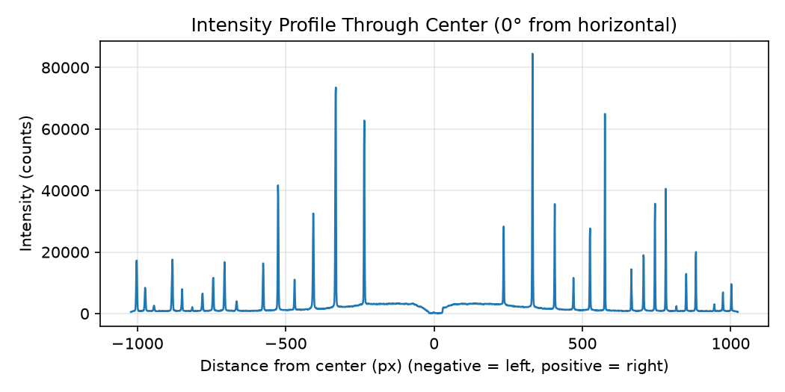
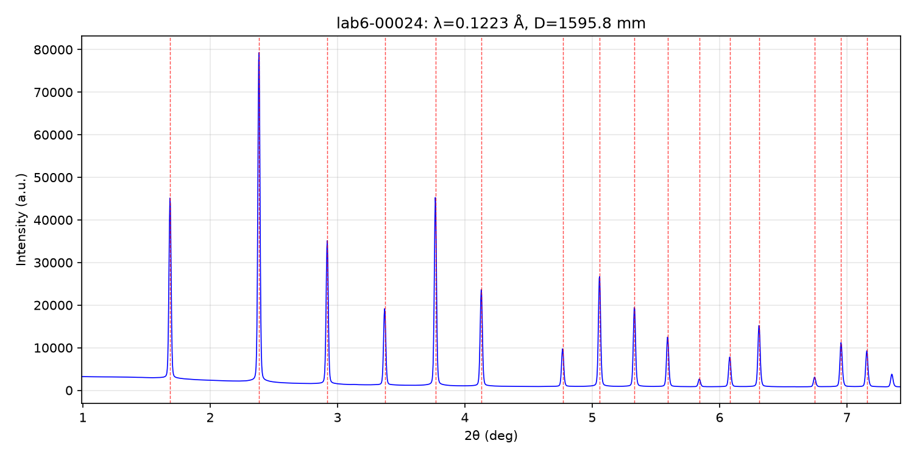
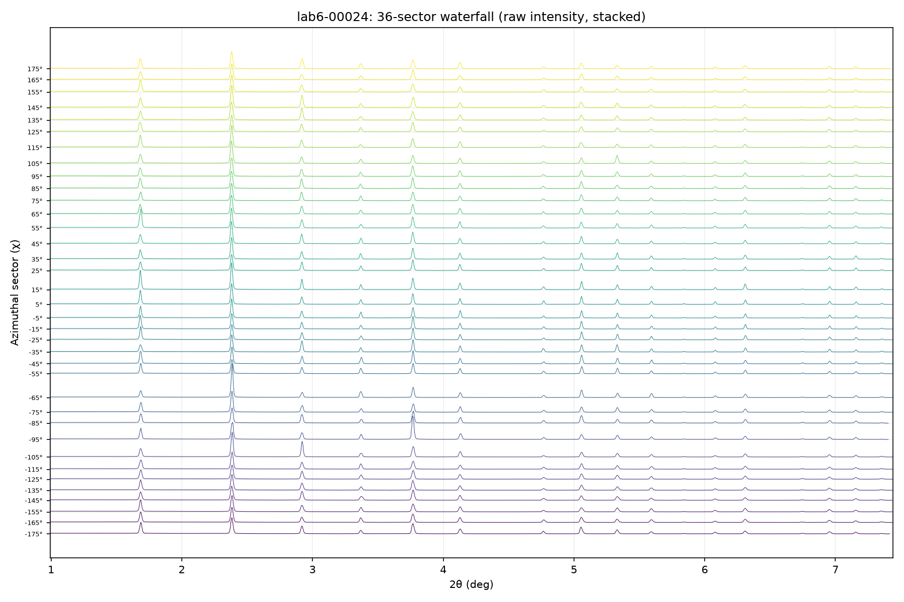

# XRD Toolkit

XRD 衍射图像处理工具箱：读取 .tif / .edf / .cbf 衍射数据，支持二维衍射图与强度剖面查看（自动定位环圆心）、LaB₆ 几何校准（pyFAI）、2D→1D 全角度积分（标准粉末衍射谱）与扇形积分（瀑布图 / 方位均匀性分析）。

## 安装

```bash
# 1. 用 environment.yml 一键创建 conda 环境（只需一次）
conda env create -f environment.yml
# 2. 激活环境
conda activate XRD_Toolkit_Environment
# 3. 安装本项目（numpy / matplotlib / fabio 依赖会自动装上）
pip install -e .
```

## 使用

典型流程：`view_diffraction`（看图）→ `calibrate_integrate`（几何校准）→ `integrate_pattern`（1D 标准谱）→ `sector_waterfall`（方位均匀性检查）。所有输出都在 `outputs/{数据文件名}/` 下。

四个脚本都支持两种方式选文件：`--file` 指定单个文件；不带 `--file` 则弹出交互菜单，列出 `data/` 里所有数据文件按编号选择（`1,2` 多选、`all` 全选）。菜单逻辑统一在 `xrd_toolkit/cli.py`，四个脚本共用一份。

三个积分脚本（calibrate_integrate / integrate_pattern / sector_waterfall）都支持 `--range`：`full`（完整数据，txt 母版永远存这一版）、`auto`（默认，自动选区）、`lo,hi`（手动指定，如 1.3,7.3）。`auto` 的下界按材料专属标准选取（LMFP：第一个已知峰 − 0.3°；LaB₆：检测到的光环结束点 − 0.6°，≈1.0°），上界自动检测"数据失效点"——环被方形探测器切掉、多数扇区死亡的位置（实测 ≈7.44°，与几何精确计算互相印证）。

```bash
python scripts/view_diffraction.py --file data/xxx.tif --angle 0 --outdir outputs
```

> 注意：示例数据没有上传到仓库，请把 `data/xxx.tif` 换成你自己的衍射数据文件路径。

参数说明：
- `--file`：衍射图像路径（.tif / .edf / .cbf）
- `--center`：环圆心坐标 cx,cy，不填则自动定位（利用衍射图关于圆心中心对称的物理性质，FFT 互相关，任何新数据都通用，精度 < 1 px）
- `--angle`：剖面线与水平方向的夹角（度），默认 0
- `--outdir`：PNG 输出目录，默认 outputs/

### 几何校准 + 1D 图谱（LaB₆ 标样）

```bash
python scripts/calibrate_integrate.py --file data/xxx.tif --wavelength 0.1223 --pixel 200 --dist0 1600
```

- `--wavelength`：X 光波长（Å）
- `--pixel`：探测器像素尺寸（µm）
- `--dist0`：探测器距离初值（mm），脚本用 pyFAI 自动精修出精确值
- `--center`：环心初值 cx,cy（像素，不传则自动定位，精度 <1 px）
- `--max-rings`：参与校准的环数（默认 16）
- `--range`：2θ 区间——`full` / `auto`（默认，材料专属标准）/ `lo,hi` 度（如 1.3,7.3）；完整版 txt 永远保存

脚本流程：LaB₆ 峰位校准（pyFAI GeometryRefinement）→ 方位角积分（2D→1D）→ 输出 1D 图谱（`outputs/{数据名}/calibrated_2th.txt` + `calibrated.png`，图中红虚线为理论峰位）。校准与积分函数在 `xrd_toolkit/services/integrator.py`。

### 全角度积分（2D → 1D 标准谱）

```bash
python scripts/integrate_pattern.py --file data/xxx.tif
```

用标定好的几何做 0°–360° 完整方位角积分，输出标准两列 txt（2θ(deg), intensity）+ PNG 图谱，供后续寻峰、拟合、PDF 分析使用。几何参数默认使用任务三标定值（1595.80 mm 等），同一批实验通用；可用 `--dist`、`--poni`、`--wavelength` 覆盖。

### 扇形积分 + 瀑布图

```bash
python scripts/sector_waterfall.py --file data/xxx.tif --n-sectors 36
```

把 0°–360° 方位角分成 N 个扇区分别积分（默认 36 个，每 10° 一个），输出每个扇区的两列 txt（`outputs/{数据名}/sectors/`）+ 一张原强度堆叠瀑布图（36 条曲线沿 Y 轴错开、行间距自适应，每条画到自己强度变 0 的位置——右端阶梯即各扇区衍射环被探测器边缘切掉的位置），用于检查衍射环的方位均匀性（大晶粒、择优取向会表现为强度集中在少数扇区）。

## 项目结构

```
.
├── data/                       # XRD 原始数据（.tif，不进 git）
├── outputs/                    # 生成的示例图与数据（按数据文件分文件夹）
├── scripts/
│   ├── view_diffraction.py     # 衍射图查看器（画图 + 线剖面）
│   ├── calibrate_integrate.py  # LaB₆ 几何校准 + 方位角积分（2D→1D）
│   ├── integrate_pattern.py    # 全角度积分：2D 图 → 标准 1D 谱（两列 txt）
│   └── sector_waterfall.py     # 扇形积分（36 扇区）+ 瀑布图 + 方位均匀性统计
├── src/xrd_toolkit/
│   ├── config.py               # 全局配置（标定几何参数，全项目唯一一份）
│   ├── cli.py                  # 命令行共用交互选文件菜单（四个脚本共用）
│   ├── core/processor.py       # 图像计算（线剖面、自动定位环圆心）
│   ├── services/data_loader.py # 数据读取（fabio）
│   ├── services/integrator.py  # 几何校准 + 1D 积分（pyFAI）
│   └── services/range_selector.py # 自动 2θ 区间选择（材料专属标准）
├── tests/                      # 测试（暂空，后续补）
├── environment.yml             # conda 环境定义（一键创建环境）
├── pyproject.toml              # 项目元信息与依赖
└── README.md                   # 项目说明
```

## 输出示例

以下图片来自 LaB₆ 标样数据集 `lab6-00024`（姊妹数据集 `LMFP_1_atten0-00029`）。

二维衍射图（对数色标，黑边白芯小十字标记自动定位的环圆心，白色虚线为剖面线取样方向，标题注明圆心坐标）：


过圆心的强度剖面（横轴为到圆心的距离，单位像素）：



校准后的 1D 图谱（红虚线为 LaB₆ 理论峰位）：



36 扇区瀑布图（原强度堆叠，每条曲线按方位角沿 Y 轴错开、画到自己强度变 0 处，右端阶梯即探测器切环位置）：


