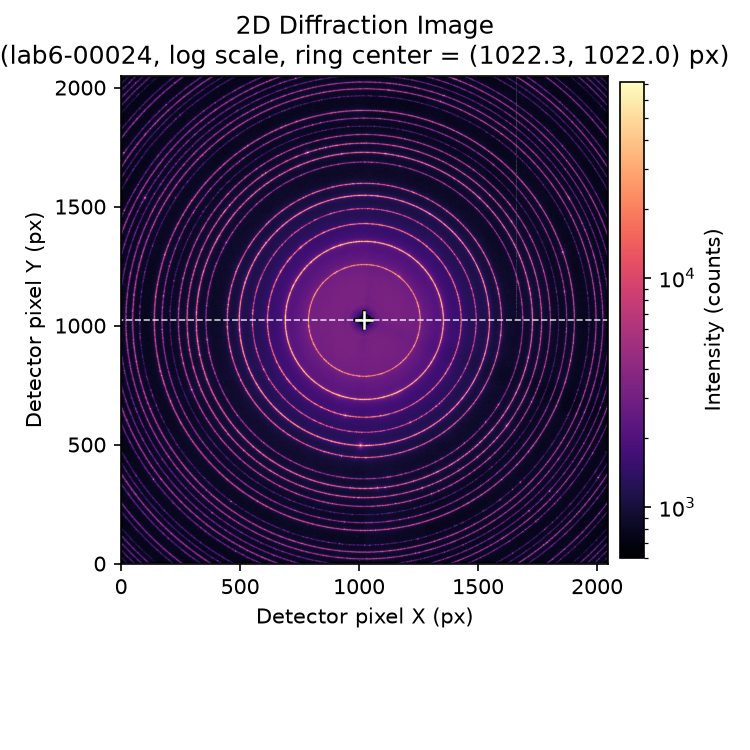
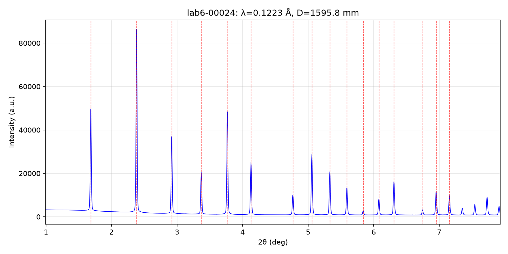
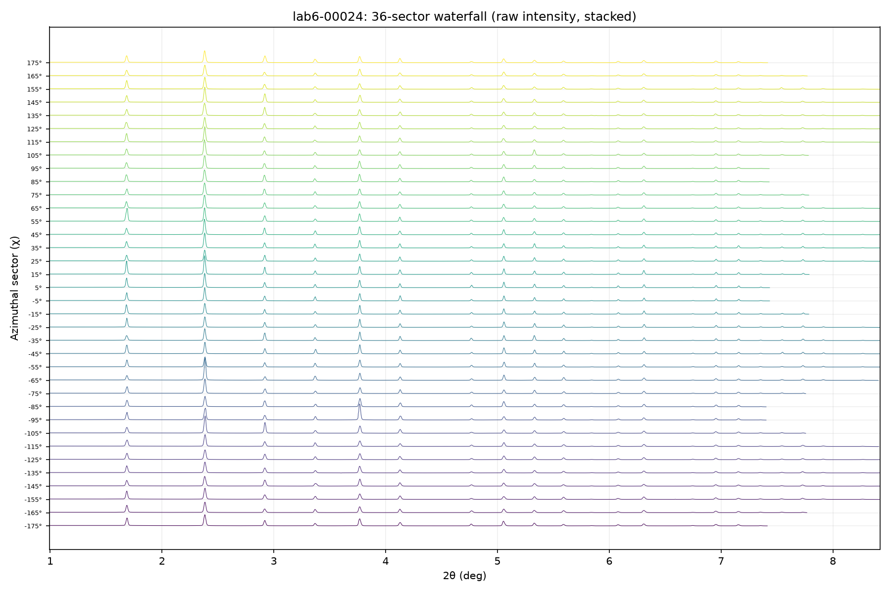
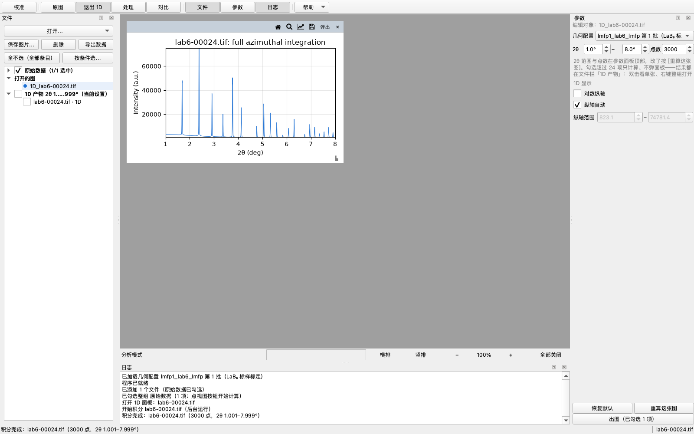
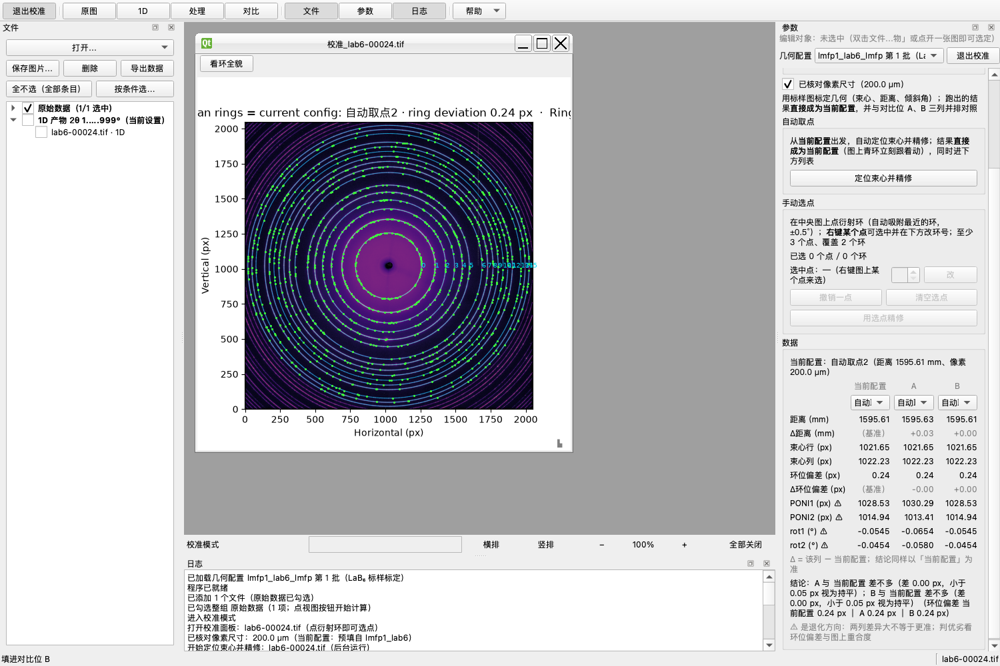
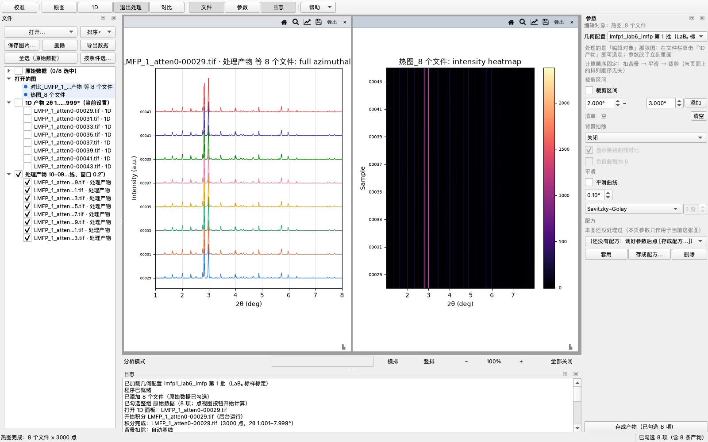

# XRD Toolkit

XRD 衍射图像处理工具箱：读取 `.tif` / `.edf` / `.cbf` 二维衍射数据，用 LaB₆ 标样做几何校准，把二维衍射图积分成标准 1D 粉末谱——四个命令行脚本，外加一个跑在同一个引擎上的 PySide6 桌面界面。本项目是香港城市大学 *PHY6528 Advanced Research in Applied Physics* 的课题工作。

English: [README.md](../README.md) · 试用者上手图文：[使用说明.html](使用说明.html)（程序内：帮助 → 使用说明，快捷键 F1）· 详细说明：[NOTES.zh-CN.md](NOTES.zh-CN.md) · 更新记录：[CHANGELOG.md](../CHANGELOG.md) · 引用：[CITATION.cff](../CITATION.cff)

## 下载即用（不用装 Python）

**最新试用版**——GitHub Actions 从本仓库构建的三平台独立应用（链接自动指向最新 Release）：

| 你的电脑 | 下载 |
|---|---|
| Windows 10/11 | [XRD-Toolkit-windows.zip](https://github.com/xyyzzc3/xrd_toolkit/releases/latest/download/XRD-Toolkit-windows.zip) |
| Mac（苹果芯片 M1…M4） | [XRD-Toolkit-macos-apple-silicon.zip](https://github.com/xyyzzc3/xrd_toolkit/releases/latest/download/XRD-Toolkit-macos-apple-silicon.zip) |
| Mac（Intel 处理器） | [XRD-Toolkit-macos-intel.zip](https://github.com/xyyzzc3/xrd_toolkit/releases/latest/download/XRD-Toolkit-macos-intel.zip) |

解压 → 双击。应用没做系统签名，第一次打开会被系统拦一下（Windows：更多信息
→ 仍要运行；Mac：右键 → 打开），详细步骤见 [RELEASE_NOTES.md](RELEASE_NOTES.md)。
macOS 13 起 / Windows 10 起，下载约 110 MB。zip 里还带《使用说明.html》（程序内 帮助 → 使用说明，快捷键 F1）和第三方许可声明 `THIRD_PARTY_NOTICES.txt`（程序内 帮助 → 关于）。

## 三步上手

1. **打开**——`[打开…]` 选仪器导出的 `.tif` / `.edf` / `.cbf` 图像（整个文件夹也行）
2. **出图**——勾上文件 → `[1D]` → `[出图（勾选文件）]`
3. **导出**——`[导出数据]` → 两列 txt / `.chi` / 全部数据总表

几何配置：内置第一条 LMFP 批次的标定；自己批次在 `[校准]` 页用 LaB₆ 标样标一套，
或把别人给的 pyFAI `.poni` 文件导进来。

## 一览

<table>
  <tr>
    <td align="center" width="50%">
      <br>
      <sub>二维衍射原图（对数色标）——小十字是校准后的束心</sub>
    </td>
    <td align="center" width="50%">
      <br>
      <sub>校准后的 1D 图谱——红虚线是 LaB₆ 理论峰位</sub>
    </td>
  </tr>
  <tr>
    <td align="center" width="50%">
      <br>
      <sub>36 扇区瀑布图——方位均匀性；右端阶梯即各扇区衍射环被探测器切掉的位置</sub>
    </td>
    <td align="center" width="50%">
      <br>
      <sub>界面（同一份真数据）——左边是带阶段文件夹的文件栏，右边是参数面板</sub>
    </td>
  </tr>
  <tr>
    <td align="center" width="50%">
      <br>
      <sub>校准工作台——当前几何与对比位 A / B 三列并排，带引擎指标与结论行</sub>
    </td>
    <td align="center" width="50%">
      <br>
      <sub>真 LMFP 图谱上的背景扣除——自动基线与扣完的曲线；原始、基线、结果同框</sub>
    </td>
  </tr>
  <tr>
    <td align="center" colspan="2">
      <br>
      <sub>一批图一眼扫完——同一批 8 个文件：左边八条曲线堆叠对比，右边 2θ×样品 热图</sub>
    </td>
  </tr>
</table>

## 亮点

- **2D → 1D 积分**——0°–360° 完整方位角积分，输出标准两列 txt（2θ(deg), intensity），供寻峰、拟合、PDF 分析使用。
- **校准指标抓到残差抓不到的东西**——每次校准除拟合残差外还报环位偏差中位、16 条环里完整跑出来的条数、逐环反推的晶格常数离散度：实测过残差 0.0000° 而环位偏 10 px 的情况。
- **背景扣除，实时预览**——空扫相减 / 自动基线 / 手动锚点（锚点定电平、自动基线定形状），加平滑（滑动平均 / Savitzky–Golay）与区间裁剪，全程叠着原始曲线调；负值默认保留（截到 0 会把均值抬高约 1σ）。
- **批量与分阶段产物**——文件夹一键导入、整批积分；曲线与扣背景曲线按阶段缓存（文件指纹 + 几何 + 设置的键，跨会话复用）并显示成文件栏**分组**：81 个文件的那一批，两下点击进对比图或热图，不用重积分。
- **偏置束心与扇形分析**——束心打在探测器边缘/角落的数据全程支持（pyFAI 分箱不可靠时自动切自研 numpy 积分）；36 扇区瀑布图一眼看出择优取向与被切环的几何。
- **桌面界面（同一引擎）**——五个阶段入口、实时参数面板、悬停读数、框选放大、单条曲线配色、`.poni` 进出、PNG/TIF 导出。

## 安装（从源码跑）

```bash
conda env create -f environment.yml    # 只需一次
conda activate XRD_Toolkit_Environment
pip install -e .                       # numpy / scipy / matplotlib / fabio / pyFAI / PySide6 一并装上
python -m xrd_toolkit.gui              # 桌面界面
```

> 示例数据没有上传到仓库，请把 `--file` 换成你自己的衍射数据路径。

```bash
# 校准 + 积分一张图（跑完会打印一段可直接粘进 config.py 的配置条目）
python scripts/calibrate_integrate.py --file data/xxx.tif --wavelength 0.1223 --pixel 200 --dist0 1600
# 用已标定的几何做全角度积分；扇形积分 + 瀑布图
python scripts/integrate_pattern.py  --file data/xxx.tif
python scripts/sector_waterfall.py   --file data/xxx.tif --n-sectors 36
```

典型流程：`view_diffraction`（看图）→ `calibrate_integrate`（几何校准）→ `integrate_pattern`（1D 标准谱）→ `sector_waterfall`（方位均匀性）。输出都在 `outputs/{数据名}/` 下。不带 `--file` 时每个脚本弹出 `data/` 里的文件菜单；三个积分脚本用 `--config 条目名` 选几何（默认 `lmfp1_lab6`）。**脚本一览与完整参数说明见 [NOTES.zh-CN.md](NOTES.zh-CN.md#脚本一览)。**

## 测试

```bash
python scripts/run_tests.py     # 700+ 条，带看门狗
```

合成图像单元测试（不需要真实数据，纯 unittest）覆盖校准与积分引擎、各背景估计器、分阶段产物缓存与界面接线。`scripts/check_gui.py` 用真数据 + 真画布事件把界面走一遍；`scripts/stress_panels.py` 是两处 offscreen 死锁的回归探针。

## 路线图

- 1D 图谱上的寻峰与峰形拟合（背景扣除先落地——扣掉基线之后峰高与峰面积才有意义）
- 线形分析：Scherrer / Williamson–Hall 尺寸-应变
- 结构因子模拟
- 基本的 Rietveld 精修引擎
- 机器学习：物相识别聚类 + 峰形 CNN 分类

## 项目结构

```
.
├── data/                       # XRD 原始数据（.tif，不进 git）
├── outputs/                    # 脚本输出 + 产物缓存（本地，不进 git）
├── showcase/                   # README 展示用的精选示例图（进 git）
├── packaging/                  # PyInstaller 打包（图标、spec、版本钉）
├── scripts/                    # 四个分析脚本 + 自检/探针工具
├── src/xrd_toolkit/
│   ├── config.py               # 几何配置注册表（每批实验一个条目，--config 选择）
│   ├── cli.py                  # 命令行共用交互选文件菜单
│   ├── core/processor.py       # 图像计算（线剖面、自动定位环圆心）
│   ├── services/               # data_loader · integrator · background · range_selector · ring_metrics · stage_cache
│   └── gui/                    # PySide6 桌面界面（python -m xrd_toolkit.gui）
├── tests/                      # 合成图像单元测试 + 界面集成测试
├── docs/                       # 英文 README、详细说明
├── environment.yml             # conda 环境定义
└── pyproject.toml              # 项目元信息与依赖
```

## 数据、隐私与合规

所有计算都在**本机**完成：程序不联网、不上传数据、没有使用统计。科研工具，
发表/交付前请复核关键数值。本程序 MIT 许可；随附第三方组件（Qt/PySide6、
pyFAI、NumPy、SciPy、Matplotlib 等）的许可全文随包分发
（`THIRD_PARTY_NOTICES.txt`，程序内 帮助 → 关于 可打开），仓库里也留了一份
[packaging/THIRD_PARTY_NOTICES.txt](../packaging/THIRD_PARTY_NOTICES.txt)。

## 作者

Chenze Bian —— 香港城市大学 物理学与数据建模及量子技术硕士 · [GitHub](https://github.com/xyyzzc3)

## 许可

[MIT](../LICENSE)
