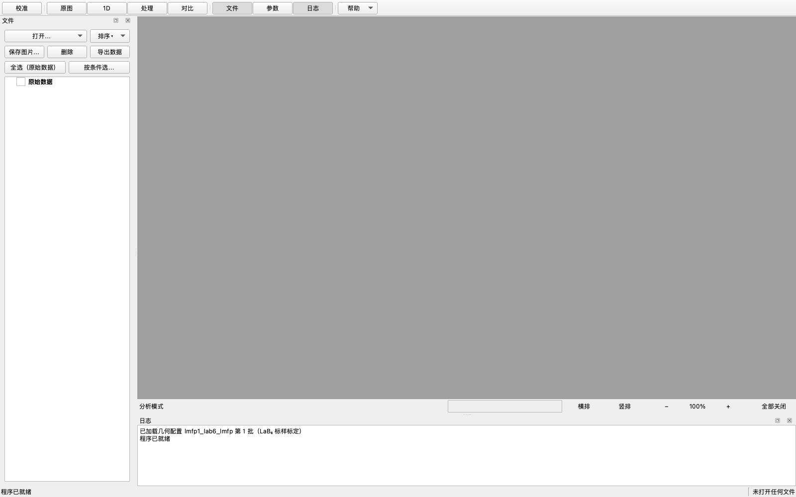
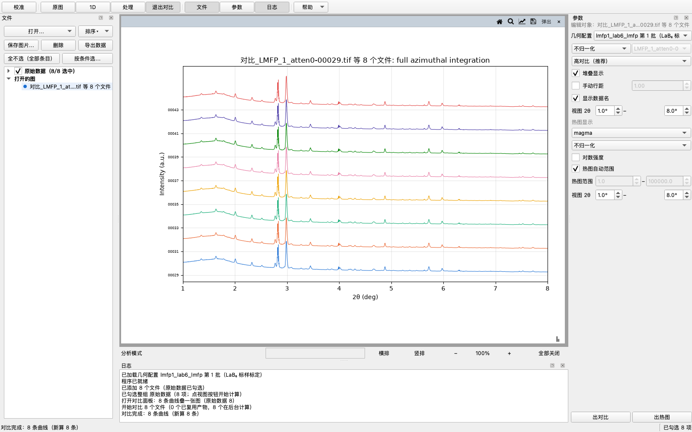

# XRD Toolkit 使用说明（v0.1.3 试用版）

把二维 XRD 衍射图像（`.tif` / `.edf` / `.cbf`）按标定好的几何积分，导出
可直接用于 Excel、Origin 或论文的 1D 曲线。

> 下面按顺序跟着做即可，每一步末尾的**确认**做到了再往下走。
> 每节最后的**「这一节还能做什么」**收纳右键菜单、导出与修改细节；
> 软件更新后如与本文不符，以界面为准。

## 1. 安装并打开软件

| 你的电脑 | 下载 |
|---|---|
| Windows 10 / 11 | [`XRD-Toolkit-windows.zip`](https://github.com/xyyzzc3/xrd_toolkit/releases/latest/download/XRD-Toolkit-windows.zip) |
| Mac（苹果芯片：M1/M2/M3/M4…） | [`XRD-Toolkit-macos-apple-silicon.zip`](https://github.com/xyyzzc3/xrd_toolkit/releases/latest/download/XRD-Toolkit-macos-apple-silicon.zip) |
| Mac（Intel 处理器） | [`XRD-Toolkit-macos-intel.zip`](https://github.com/xyyzzc3/xrd_toolkit/releases/latest/download/XRD-Toolkit-macos-intel.zip) |

（链接指向 GitHub 的**最新发布**；打不开时直接在浏览器里访问
`github.com/xyyzzc3/xrd_toolkit/releases` 手动选。）

如不确定 Mac 的芯片类型：点左上角苹果菜单 →「关于本机」，看「芯片」一行。

**Windows**：解压 zip → 进入 `XRD Toolkit` 文件夹 → 双击 `XRD Toolkit.exe`
→ 首次出现蓝色"Windows 已保护你的电脑"提示时点 **更多信息 → 仍要运行**。
（若没有"更多信息"按钮：右键 `XRD Toolkit.exe` → 属性 → 勾选「解除锁定」→
确定 → 再运行。）

**Mac**：解压 → 得到 `XRD Toolkit.app` → **第一次需右键点它 → 选「打开」**
→ 弹窗里再点一次「打开」。此后双击即可。

> 第一次启动会多花十几秒（系统安全检查 + 首次建立字体缓存）。
> 软件未做系统签名，被系统拦截一次属于预期现象。

**确认**：看到主窗口——左边「文件」区（先空着）、中间绘图区（也空着）；
**右边参数面板此刻是收起的**，选中文件或打开一张图后会自动出现；
顶上一行是工具栏：`[校准] │ [原图] [1D] [处理] [对比] │ [文件] [参数] [日志] │ [帮助▾]`。

## 2. 导入数据

1. 左上「文件」区点 `[打开…]` → 选「打开文件…」（可多选）或「打开文件夹…」
   （整个目录一次导入）。菜单底部的「最近打开」可以快速再开上次用过的。
   **确认**：文件列表里出现你的文件名。
2. 勾选要处理的文件：点条目行最左边的对号框（勾一组就点组那一行）。

> 提示：**双击一个原始条目 = 打开它本身的 2D 图**（零计算、秒开）；
> 要 1D / 剖面 / 瀑布就点顶部的对应按钮（见第 4、5 节）。

**这一节还能做什么**

- **拖文件夹直接进窗口**：与「打开文件夹…」同效。
- **勾选的几种手势**：点条目行 = 勾上这一条；点对号方块 = 勾上/取消；
  点组行 = 整组勾上；`[全选（原始数据）]` / `[全不选（全部条目）]` /
  `[按条件选…]`（范围、间隔、名字过滤，带实时计数）。
- **`[排序▾]`**：改「原始数据」的排列方式——「导入顺序」（默认，每次打开
  软件都回到它）/「名称」（自然顺序：名字里的数字按数值比，`…-00029`
  排在 `…-00100` 前）/「修改时间」（最新的在最上面）。各产物分组的行序
  跟着走，勾选与高亮不动。注意：`[按条件选…]` 的"第 N 个"按**当前显示
  的顺序**数。
- **右键菜单**（对不同的行内容不同）：
  - 原始条目：`打开 1D 图（文件名）`、`从文件栏移除（硬盘上的文件不动）`；
  - 产物条目：`打开 1D 图`、`删除这一条产物`、`导出这一条（txt / chi）`；
  - 组行：`打开整组 1D 图（N 张）`、`删除这一组产物（N 条）`、
    `导出这一组（txt / chi / CSV）`；
  - 空白处 /「原始数据」组：`打开勾选的 N 张图` 与 `打开整组图`——都是
    **子菜单选视图**（1D / 2D / 剖面 / 瀑布），**没有张数上限**（超过
    25 张先弹确认：每张约 15 MB）；另有 `删除所有缓存…`（见第 8 节）。
- **重复导入同一个文件**会弹询问：保留原条目 / 改名后加入 / 这次不加。
  选"改名后加入"会有两条条目，但同一份数据**只算一遍**——批量出图时
  重复的那条**整条跳过**（只开一张图、只存一份产物），批完成的张数就是
  不重复的文件数，日志里会写明；要看重复的那条：**双击它单独开**
  （1D 从产物缓存秒开）。

## 3. 几何配置——积分准不准由它决定

**几何不对，积分出来的峰位整体就是偏的**——所以先确定几何，再出 1D。
你的几何来源是哪种：

| 情况 | 做什么 |
|---|---|
| 处理**本实验室第 1 批**数据 | 软件内置了它的标定 `lmfp1_lab6`，**确认**参数面板顶部「几何配置」那一行选的是它即可 |
| 别人给了 `.poni` 文件 | 参数面板 `[加载几何…]` 直接导入 |
| **新批次**、或动过探测器 | 需要自己标定一次（只做一次，整批通用）——按下面 4 步 |

**自己标定（照片级操作，一次到位）**：

1. 拍一张 LaB₆ 标样图，按第 2 节导入并勾选。
2. 点顶部 `[校准]`。**确认**：中央出现标样图，图上有青色理论环。
3. 点 `[定位束心并精修]`，等日志出现「完成」。
   **确认**：数据区的「环位偏差」小于 1 px（越小越好）、「完整环」为 16/16。
4. 点 `[保存为配置]`，在「条目名称」里起个名字（如 `batch2_lab6`）。
   **确认**：参数面板顶部的「几何配置」一行能选到新名字。

> 拟合残差为 0 不代表标定正确——判好坏看「环位偏差」与「完整环数」。

**校准页的「数据」框怎么读**

页面下方的「数据」框是标定结果的账本：

- **三列**：**当前配置**（正在用的那份几何）+ 两个对比位 **A**、**B**。
  每次跑出来的结果（自动取点1、手动选点1…）**直接成为当前配置**，同时
  进累积列表；想比较两份结果，就在 A、B 列顶上的下拉框里各选一份——
  手动选过的列会被"钉住"，之后的新结果不再覆盖它。
- **每一行**：距离、束心行/列、环位偏差、PONI、倾斜角；**判好坏只看
  「环位偏差」**——标 ⚠ 的行（PONI、倾斜角）与距离/波长方向近简并，
  数字差得多不等于更准。「Δ」行 = 该列 − 当前配置，结论同样以当前配置
  为准（当前配置那一列的 Δ 行写着「（基准）」）。
- **结论行**：把 A、B 分别与当前配置比一遍，好多少/差多少都写出来；
  日志里同样有一份。

**这一节还能做什么（校准页）**

- **手动选点**：在中央图上点衍射环（自动吸附最近的环，±0.5°）；
  右键某个点可选中并在下方改环号；至少 3 个点、覆盖 2 个环，然后
  `[用选点精修]`。自动定位结果不满意时用它。
- **改用别人/以前的几何**：`[加载几何…]`（import `.poni`）、
  `[编辑当前配置…]`（从某条目预填或手输）。
- **这一步的"导出"＝`[保存几何…]`**：把当前几何存成 `.poni` 文件，
  可以发给别人、或用别的软件。

## 4. 原图（2D / 剖面 / 瀑布）

1. 在文件栏勾选文件（第 2 节）。
2. 点顶部 `[原图]`，再点 `[2D]` / `[剖面]` / `[瀑布]` 中的一个——
   **点一下 = 对勾选文件立即出图**。想换类型就点另一个按钮。
   **确认**：中央出现图面板；勾选超过 25 项时**一张都不弹**（防爆图——
   2D/剖面/瀑布没有产物可留；要看整批用 [热图]/[对比]；想一张张全开，
   右键文件栏 → `打开勾选的 N 张图` → 选 2D/剖面/瀑布。日志里都写明）。
3. 三种视图的参数在右侧分三节（2D 视图 / 剖面 / 瀑布），**改完立刻生效**；
   `[恢复默认]` 一键复位全部显示参数。

**这一节还能做什么**

- **每张图面板顶上一行按钮**（所有视图通用）：
  `[复位视图]`（回到这张图最初的视野）、`[放大镜]`（点亮 = 滚轮缩放、
  左键拖框选放大；不点亮 = 滚轮滚动、左键拖动平移）、
  `[外观…]`（改标题、轴标签、纵轴线性/对数、图边距；对比图还有逐条颜色）、
  `[保存图片…]`、`[弹出]`（独立窗口）、`[关闭]`；
  **拖动这一行 = 移动面板，双击 = 占满绘图区**。
- **这一步的"导出"＝`[保存图片…]`**：把图另存为 PNG / TIF（可选分辨率），
  存的就是当前画面（含缩放）。数据导出见第 5、6 节。
- 鼠标在曲线上移动：绘图区横带实时显示该点读数（2θ / 强度或距离，悬停
  对比图还会报曲线名）。
- **文件栏里的「打开的图」组**：列出当前开着的每张图——单击 / 双击 = 提到
  最前面并成为「编辑对象」；右键 = `提到最前面` / `关闭这一张图
  （数据与产物都不动）`。

## 5. 1D——积分出谱（最常用的一步）

1. 在文件栏勾选文件。点顶部 `[1D]`，再点页面底部的
   `[出图（已勾选 N 项）]`。**确认**：中央画出曲线，窗口标题形如
   `1D_文件名`；日志出现「积分完成」。
2. 2θ 范围与点数在右侧参数面板顶部那一行；改了要点
   `[重算这张图]` 才生效。**确认**：日志再次出现「积分完成」。

**导出（就在这一步）**

点文件区 `[导出数据]` → 选输出目录 → 弹导出对话框（各选项作用如下）：

| 对话框选项 | 含义 |
|---|---|
| **文件后缀** | `.txt`（两列文本，Excel/Origin 通用）或 `.chi`（同格式、给部分软件） |
| **同时生成全部数据总表** | 勾选 ≥2 条时可用（默认勾）：多出一张 `全部数据.csv`，每个文件一列强度 |
| **导出处理后的曲线（背景/平滑/裁剪）** | **默认不勾 = 导出原始积分结果**；勾上 = 按「处理」页的当前设置，把扣过背景 / 平滑 / 裁剪后的曲线导出去。**只对「原始数据」条目生效**，「1D 产物」「处理产物」条目原样导出。两个注意：① 扣背景后出现负值是正常的（噪声地板）；② 如果「处理」页三项都没开，勾了也等于没处理——文件里会照实标 `Raw`、日志里也会说明" |

**确认**：得到文件——单条 = 一个 `xxx_1D.txt`；多条 = 新建文件夹
`导出_日期_时间_内容标签/`（内含每条一个 `txt/` 和一张 `全部数据.csv`）。
**同名文件不会被覆盖**，自动加序号（`_2`、`_3`），日志写明。

**这一节还能做什么**

- 右键条目 → `导出这一条（txt / chi）`；右键组行 → `导出这一组（txt / chi / CSV）`
  （同一个导出对话框）。
- 超过 25 张没弹出面板：1D 只计算不弹面板（结果在文件栏「1D 产物」组，
  双击看单张）；原图（2D/剖面/瀑布）一张都不弹——用 [热图]/[对比]
  看整批，或右键文件栏 → `打开勾选的 N 张图` → 选视图一次全开
  （每张约 15 MB，先弹确认），或减少勾选分批看。

## 6. 处理——背景扣除、平滑与裁剪

处理的对象是「编辑对象」那张图：先在文件栏**双击一条「1D 产物」**选定它。

1. 点顶部 `[处理]`。
2. **背景扣除**（最常用）：模式选「**自动基线（推荐）**」，窗口保持 0.2°。
   **确认**：图上出现扣过背景的曲线。
   - 想再校一校：自动模式下也能 `[拾取锚点]`——在图上点几处"只有背景"
     的位置（避开峰），基线会**经过这些点**（在自动形状上做校正；覆盖
     范围写在下面的配方行里）。下图就是自动基线 + 四个锚点校正的样子。
   - 「空扫相减」最干净（需要拍过空扫图并选进来）；
   - 「手动锚点」= 完全靠你点的点推基线，适合宽鼓包样品。
   - 负值会保留（噪声本底是真实的）——这是有意设计。
3. **平滑**：默认 Savitzky–Golay、窗口 0.10°，对峰形保留最好；窗口别取到
   峰宽量级，否则会削峰。
4. **裁剪**：把强度极高、压低其余信号的强峰挖空——填起止（如 2.5–2.6°）
   → `[添加]`，可以加好几段。
5. 整批套用：在文件栏勾选要处理的文件 → `[存成产物（已勾选 N 项）]`。
   **确认**：文件栏出现「处理产物」分组。

**导出（就在这一步）**

处理产物用**同一个导出流程**：勾选它 → 点 `[导出数据]`（或右键
`导出这一条 / 这一组`）。对它来说，导出对话框里"导出处理后的曲线"那个
勾**勾不勾都一样**——它本身就是处理后的数据（文件里标 `Processed`，
并在表头写明跑过哪条处理链）。

**这一节还能做什么**

- **配方**：`[存成配方…]` 把当前这套处理设置存成一份配方（存的是**设置**，
  不是数据）。之后在"本图配方"下拉里**选一份** → 点 `[套用]`，就把它
  用到当前「编辑对象」那张图上（按了才动，打开面板不会自动套用）；
  锚点位置共用、强度按目标文件重新取。
- **数据 vs 设置的区分**：`[存成产物（已勾选 N 项）]` 存的是**数据**（进
  「处理产物」组，能去对比/热图/导出）；`[存成配方…]` 存的是**设置**。

## 7. 对比（含热图）

1. 勾选 2 条以上曲线（原始数据 / 1D 产物 / 处理产物都行）→ 点顶部
   `[对比]`。**确认**：多条曲线叠在一张图里。
2. 条数多的时候（几十张），在右侧「对比」页勾 `[堆叠显示]`——曲线上下
   错开排，一眼看清每一条；再勾 `[显示数据名]` 会有纵轴样品名（两个
   开关**默认都关着**，认线也可以看悬停读数）。
3. **热图**：回到 `[对比]` 页点 `[出热图]`——整批拼成一张 2θ × 样品的
   强度图；**点某一行 = 在对比面板里显示/隐藏该样品曲线**。

**导出（就在这一步）**

- **数据**：勾选参与对比的条目 → `[导出数据]`（同第 5 节流程）；
- **图**：面板标题行的 `[保存图片…]`。

**这一节还能做什么**：归一化（不归一化 / 全局最强峰 / 指定数据）、
曲线配色、堆叠显示 + 手动行距——都在「对比」页，改完立刻生效；
**缩看某一段 2θ**：用「视图 2θ」框（对比与热图各有一对）填起止，
图立刻裁到那一段（只改窗口、不重算）。

## 8. 缓存与"第二次打开"

**缓存是什么**：所有算过的 1D 结果都存在本机 `XRD_Toolkit/_stage` 里。

- **`_stage` 可以删**（右键文件栏空白处 →「删除所有缓存…」）：删了不发
  生错误，只是下次点 `[1D]` 要重新算、慢一点；适合清理磁盘空间。
- **不建议删**：`config_user.json`（你的标定配置——删了要重新校准）；
  导出好的数据文件（你自己管理）。
- 「最近打开」记录（`recent.json`）随便删，只是少了快捷入口。

**第二次打开同一批数据会发生什么**：

- 软件**不记忆文件栏**——重开是空的，要重新 `[打开…]` 导入（或用
  「最近打开」）；
- 导入后，**已经算过的「1D 产物」会自动列出来**（缓存还在），
  **不用重算**；
- 但**勾选是空的**，要重新勾选——点 `[1D]` 时日志会写"复用 N 条"，秒出；
- 改了 2θ 范围或点数再出图 = 按新参数**另算一份**，旧产物**不会消失**，
  文件栏里两份并存（组名带各自的参数）；
- 处理过的图同理：处理产物留在「处理产物」组里，重新导入后照常可见。

## 9. 文件都在哪

所有东西都在 **`个人文件夹/XRD_Toolkit`**（Windows 是 `文档\XRD_Toolkit`），
导出对话框显示的也是这个路径：

- **导出的数据**：由你自己指定目录；单条 = 一个文件，多条 = 一个
  `导出_日期_时间_内容标签/` 文件夹（见第 5 节）；
- **`_stage`**：计算缓存（可删，见第 8 节）；
- **`config_user.json`**：你的标定配置（别删）；
- **`recent.json`**：最近打开记录（随便删）；
- **`crash-watch.txt`**：程序出错时的现场记录（报错时发给开发者用，
  里面可能含本机文件路径，对外分享前可以先看一眼）。

## 常见问题

| 现象 | 怎么办 |
|---|---|
| 双击没反应 / 提示"已损坏" | Mac：右键 → 打开（第 1 节）；Windows：更多信息 → 仍要运行 |
| 第一次打开很慢 | 正常，正在建立字体缓存 |
| 软件里什么都没有 | 先 `[打开…]` 导入图像，再勾选文件，再出图（第 2、5 节） |
| 点 `[出图（已勾选 N 项）]` 没反应 | 检查文件行最左边的对号框是否勾上——只画勾选的条目 |
| 峰位整体偏、环不圆 | 几何配置不对——回到第 3 节重新确定几何 |
| 曲线噪声大 / 背景高 | `[处理]` 页做背景扣除与平滑（第 6 节） |
| 导出文件里出现了负值 | 扣过背景是正常的（噪声地板）；想要原始强度就**不勾**
"导出处理后的曲线"（第 5 节） |
| 想清理缓存释放空间 | 文件栏右键 →「删除所有缓存…」（导出和配置不受影响，第 8 节） |
| 程序出错 | 把 `个人文件夹/XRD_Toolkit/crash-watch.txt` 与界面截图发给开发者 |

## 数据、隐私与许可

- **所有计算都在你自己的电脑上完成**：软件不联网、不上传任何数据、没有
  使用统计（遥测）。实验数据不出本机。
- `crash-watch.txt` 是崩溃现场记录，**可能包含本机文件路径**；对外分享前
  可以先自己打开查看。
- 免责：本软件是科研工具，结果取决于几何标定与参数选择，**发表或交付前
  请人工复核**关键数值。
- 许可：本软件采用 MIT 许可；随附的第三方组件（Qt/PySide6、pyFAI、NumPy、
  SciPy、Matplotlib 等）各自的许可全文见随包文件 `THIRD_PARTY_NOTICES.txt`。
- 引用：论文引用本软件时，请参照软件仓库中的 `CITATION.cff`。
